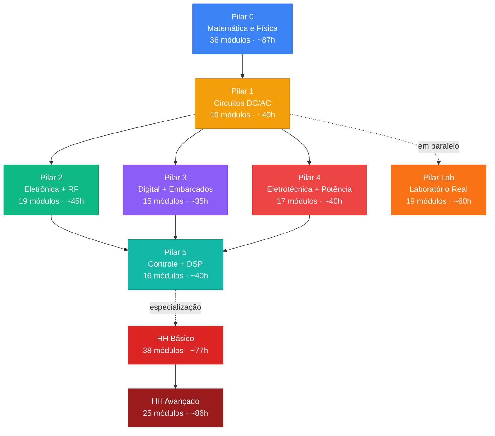

# ⚡ Jornada de Engenharia Elétrica & Hardware Hacking

<div align="center">

**Currículo autodidata de EE + Segurança de Hardware**

[](#pilares)
[](#estatísticas)

</div>

---

## O que é isso?

Meu currículo autodidata de Engenharia Elétrica, desenvolvido em paralelo com minha graduação na UTFPR. São 7 pilares de EE (do básico ao avançado) + 2 roadmaps de hardware hacking, totalizando ~500 horas de estudo com projetos práticos documentados.

A ideia é simples: **simular primeiro, entender intuitivamente, depois formalizar**. Cada módulo tem teoria focada + um projeto prático que vai pra este repositório.

A especialização em hardware hacking é o meu objetivo final — entender sistemas por dentro e saber como quebrá-los.

**Progresso detalhado**: [PROGRESS.md](PROGRESS.md) · **Diário de estudo**: [STUDY_LOG.md](STUDY_LOG.md)

---

## Mapa do Currículo



---

## Pilares

| # | Pilar | Módulos | Horas | O que cobre | Status |
|:-:|-------|:-------:|:-----:|-------------|:------:|
| 0 | [Matemática e Física](pillar-0-math-physics/) | 36 | ~87h | Pré-Cálculo → Cálculo I-III → EDOs → Álgebra Linear → Probabilidade → Mecânica → EM → Semicondutores | 🔲 |
| 1 | [Circuitos DC/AC](pillar-1-circuits/) | 19 | ~40h | Ohm → KVL/KCL → Thévenin → RC/RL/RLC → AC → Fasores → Filtros → Potência | 🔲 |
| 2 | [Eletrônica + RF](pillar-2-electronics/) | 19 | ~45h | Diodos → BJT → MOSFET → Amp-Op → DC-DC → Fontes → Linhas de TX → Smith Chart → EMC | 🔲 |
| 3 | [Digital + Embarcados](pillar-3-digital/) | 15 | ~35h | Portas Lógicas → Boole → Karnaugh → FSMs → Arduino → ADC/PWM → Serial → IoT | 🔲 |
| 4 | [Eletrotécnica + Potência](pillar-4-power/) | 17 | ~40h | Trifásico → Transformadores → Motores → Proteção → CLPs → Síncrono → Potência → Harmônicos | 🔲 |
| 5 | [Controle + DSP](pillar-5-control-dsp/) | 16 | ~40h | Sinais → Fourier → Laplace → Bode → PID → Nyquist → Z-Transform → FIR/IIR → FFT | 🔲 |
| 🔬 | [Laboratório Real](pillar-lab/) | 19 | ~60h | Bancada → Multímetro → Osciloscópio → Solda → KiCad → Arduino/ESP32 físico → Projeto completo | 🔲 |

### Hardware Hacking

| Nível | Módulos | Horas | O que cobre | Status |
|-------|:-------:|:-----:|-------------|:------:|
| [Básico](hardware-hacking/) | 38 | ~77h | Setup → UART/SPI/I2C → JTAG → Firmware RE → RF/BLE → Side-Channel → CTFs | 🔲 |
| [Avançado](hardware-hacking-advanced/) | 25 | ~86h | FPGA → PCIe/USB → Silício → TrustZone/SGX → Criptoanálise → OT/Automotive | 🔲 |

🔲 = não iniciado · 🟡 = em progresso · ✅ = completo

---

## Estrutura

```
.
├── README.md                     ← este arquivo
├── PROGRESS.md                   ← checkboxes de todos os 204 módulos
├── STUDY_LOG.md                  ← diário de estudo
├── TEMPLATE_PROJECT.md           ← template pra documentar projetos
│
├── pillar-X-nome/
│   ├── README.md                 ← roadmap completo do pilar
│   └── projects/                 ← pastas dos projetos feitos
│
├── hardware-hacking/
├── hardware-hacking-advanced/
└── assets/                       ← fotos, capturas de osciloscópio, schemas
```

Cada pilar tem seu README com o roadmap completo e cross-references pros outros pilares. Os projetos ficam em `projects/`, documentados seguindo o [template](TEMPLATE_PROJECT.md).

---

## Ferramentas

**Simulação**: Falstad · LTspice · Wokwi · KiCad · Python (numpy/scipy) · GNU Octave · Ghidra · Icarus Verilog + GTKWave

**Hardware** (compro conforme preciso):
| O quê | Pra quê | Quanto |
|-------|---------|:------:|
| Multímetro + protoboard + componentes | Começar | ~R$100 |
| Arduino Uno | Embarcados | ~R$40 |
| Ferro de solda | Montagem permanente | ~R$80 |
| Osciloscópio | Ver sinais | ~R$150-600 |
| ESP32 | IoT / WiFi | ~R$35 |
| Bus Pirate / FTDI | Hardware hacking | ~R$50-100 |
| FPGA iCEstick | HH avançado | ~$25 |

---

## Como navegar

**Se tá estudando**: pega o pilar que te interessa, abre o README, segue os módulos na ordem. Cada projeto que terminar, joga em `projects/` usando o template e marca no PROGRESS.md.

**Se tá avaliando**: olha o [PROGRESS.md](PROGRESS.md) pra ter uma visão geral, depois entra nas pastas de `projects/` pra ver o que foi feito na prática. O [STUDY_LOG.md](STUDY_LOG.md) mostra consistência.

---

## Referências

- [3Blue1Brown](https://www.3blue1brown.com/) — intuição matemática
- [Ben Eater](https://www.youtube.com/beneater) — computadores do zero
- [EEVblog](https://www.youtube.com/eevblog) — eletrônica prática
- [The Art of Electronics](https://artofelectronics.net/)
- [Hardware Hacking Handbook](https://nostarch.com/hardwarehacking)
- [ChipWhisperer](https://github.com/newaetech/chipwhisperer) — side-channel open-source

---

Roadmaps criados por mim com auxílio de IA. Use como inspiração pro seu próprio estudo.
