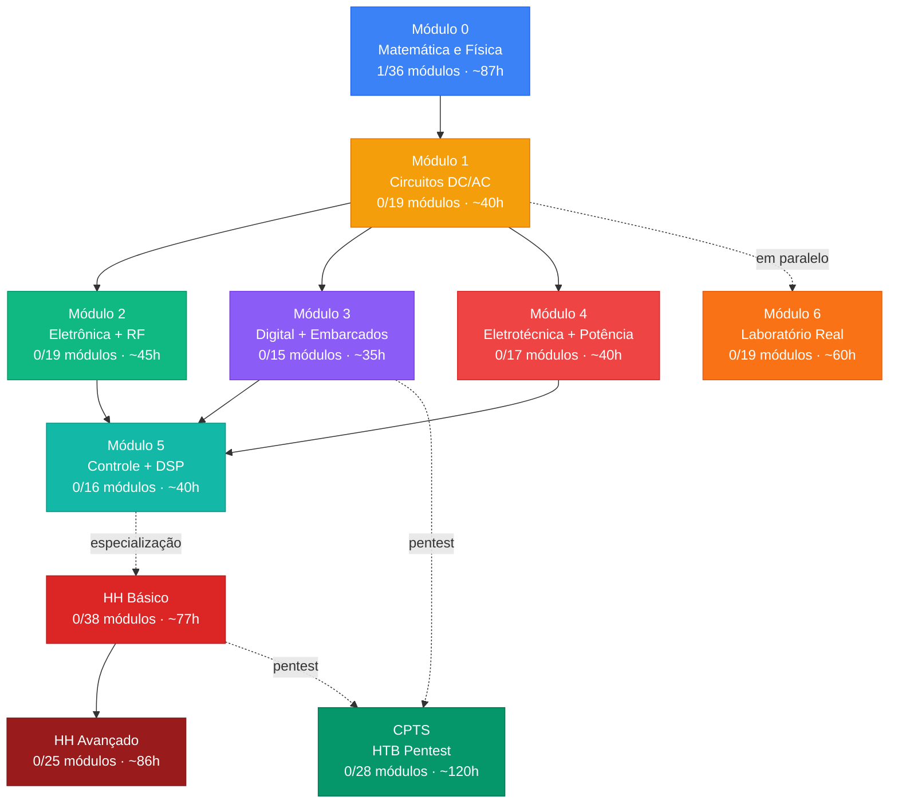

# Jornada de Engenharia Elétrica & Hardware Hacking

<div align="center">

**Currículo autodidata de EE + Segurança de Hardware**

[](#pilares)
[](#estatísticas)

</div>

---

## O que é isso?

Meu currículo autodidata de Engenharia Elétrica, desenvolvido em paralelo com minha graduação na UTFPR. São 7 pilares de EE (do básico ao avançado) + 2 roadmaps de hardware hacking + path de certificação HTB CPTS, totalizando ~620 horas de estudo com projetos práticos documentados.

A ideia é simples: **simular primeiro, entender intuitivamente, depois formalizar**. Cada módulo tem teoria focada + um projeto prático que vai pra este repositório.

A especialização em hardware hacking é o meu objetivo final — entender sistemas por dentro e saber como quebrá-los.

**Progresso detalhado**: [PROGRESS.md](PROGRESS.md) · **Diário de estudo**: [STUDY_LOG.md](STUDY_LOG.md) · **Guia de absorção**: [GUIA_DE_ESTUDO.md](GUIA_DE_ESTUDO.md)

---

## Mapa do Currículo


```mermaid
graph TD
    P0["Módulo 0<br/>Matemática e Física<br/>1/36 módulos · ~87h"]
    P1["Módulo 1<br/>Circuitos DC/AC<br/>0/19 módulos · ~40h"]
    P2["Módulo 2<br/>Eletrônica + RF<br/>0/19 módulos · ~45h"]
    P3["Módulo 3<br/>Digital + Embarcados<br/>0/15 módulos · ~35h"]
    P4["Módulo 4<br/>Eletrotécnica + Potência<br/>0/17 módulos · ~40h"]
    P5["Módulo 5<br/>Controle + DSP<br/>0/16 módulos · ~40h"]
    LAB["Módulo 6<br/>Laboratório Real<br/>0/19 módulos · ~60h"]
    HHB["HH Básico<br/>0/38 módulos · ~77h"]
    HHA["HH Avançado<br/>0/25 módulos · ~86h"]

    P0 --> P1
    P1 --> P2 & P3 & P4
    P2 & P3 & P4 --> P5
    P1 -.->|em paralelo| LAB
    P5 -.->|especialização| HHB
    HHB --> HHA
    P3 & HHB -.->|pentest| CPTS["CPTS<br/>HTB Pentest<br/>0/28 módulos · ~120h"]

    style P0 fill:#3b82f6,color:#fff,stroke:#2563eb
    style CPTS fill:#059669,color:#fff,stroke:#047857
    style P1 fill:#f59e0b,color:#fff,stroke:#d97706
    style P2 fill:#10b981,color:#fff,stroke:#059669
    style P3 fill:#8b5cf6,color:#fff,stroke:#7c3aed
    style P4 fill:#ef4444,color:#fff,stroke:#dc2626
    style P5 fill:#14b8a6,color:#fff,stroke:#0d9488
    style LAB fill:#f97316,color:#fff,stroke:#ea580c
    style HHB fill:#dc2626,color:#fff,stroke:#b91c1c
    style HHA fill:#991b1b,color:#fff,stroke:#7f1d1d
```

---

## Módulos

| # | Módulo | Módulos | Horas | O que cobre | Status |
|:-:|-------|:-------:|:-----:|-------------|:------:|
| 0 | [Matemática e Física](00-math-physics/) | 36 | ~87h | Pré-Cálculo → Cálculo I-III → EDOs → Álgebra Linear → Probabilidade → Mecânica → EM → Semicondutores | |
| 1 | [Circuitos DC/AC](01-circuits/) | 19 | ~40h | Ohm → KVL/KCL → Thévenin → RC/RL/RLC → AC → Fasores → Filtros → Potência | |
| 2 | [Eletrônica + RF](02-electronics/) | 19 | ~45h | Diodos → BJT → MOSFET → Amp-Op → DC-DC → Fontes → Linhas de TX → Smith Chart → EMC | |
| 3 | [Digital + Embarcados](03-digital-embedded/) | 15 | ~35h | Portas Lógicas → Boole → Karnaugh → FSMs → Arduino → ADC/PWM → Serial → IoT | |
| 4 | [Eletrotécnica + Potência](04-power-industrial/) | 17 | ~40h | Trifásico → Transformadores → Motores → Proteção → CLPs → Síncrono → Potência → Harmônicos | |
| 5 | [Controle + DSP](05-control-dsp/) | 16 | ~40h | Sinais → Fourier → Laplace → Bode → PID → Nyquist → Z-Transform → FIR/IIR → FFT | |
| | [Laboratório Real](06-lab/) | 19 | ~60h | Bancada → Multímetro → Osciloscópio → Solda → KiCad → Arduino/ESP32 físico → Projeto completo | |

### Hardware Hacking

| Nível | Módulos | Horas | O que cobre | Status |
|-------|:-------:|:-----:|-------------|:------:|
| [Básico](07-hardware-hacking/) | 38 | ~77h | Setup → UART/SPI/I2C → JTAG → Firmware RE → RF/BLE → Side-Channel → CTFs | |
| [Avançado](08-hardware-hacking-advanced/) | 25 | ~86h | FPGA → PCIe/USB → Silício → TrustZone/SGX → Criptoanálise → OT/Automotive | |

### Certificação

| Cert | Módulos | Horas | O que cobre | Status |
|------|:-------:|:-----:|-------------|:------:|
| [HTB CPTS](09-cpts/) | 28 | ~120h | Pentest Process → Nmap → Web Attacks → AD → Privesc → Reporting | |

[ ] = não iniciado · [x] = completo

---

## Estrutura

```
.
├── README.md                        ← este arquivo
├── PROGRESS.md                      ← checkboxes de todos os 232 módulos
├── GUIA_DE_ESTUDO.md                ← guia cold start / projeto ponte / warm start
├── progress.py                      ← script automático para ver seu progresso
│
├── 00-math-physics/
│   ├── README.md                    ← roadmap completo do pilar
│   └── projects/                    ← projetos feitos
├── 01-circuits/
├── 02-electronics/
├── 03-digital-embedded/
├── 04-power-industrial/
├── 05-control-dsp/
├── 06-lab/
│
├── 07-hardware-hacking/
├── 08-hardware-hacking-advanced/
│
├── 09-cpts/                        ← HTB CPTS certification path
│
├── notes/                           ← notas de criação de flashcards
└── assets/                          ← fotos, capturas, schemas
```

Cada pilar tem seu README com o roadmap completo e cross-references pros outros módulos. Os projetos ficam em `projects/`, documentados seguindo o [template](TEMPLATE_PROJECT.md).

---

## Ferramentas

**Simulação**: Falstad · LTspice · Wokwi · KiCad · Python (numpy/scipy) · GNU Octave · Ghidra · Icarus Verilog + GTKWave

**Hardware** (compro conforme preciso):
| O quê | Pra quê | Quanto |
|-------|---------|:------:|
| Multímetro + protoboard + componentes | Começar | ~R$100 |
| Arduino Uno | Embarcados | ~R$40 |
| Ferro de solda | Montagem permanente | ~R$80 |
| Osciloscópio | Ver sinais | ~R$150-600 |
| ESP32 | IoT / WiFi | ~R$35 |
| Bus Pirate / FTDI | Hardware hacking | ~R$50-100 |
| FPGA iCEstick | HH avançado | ~$25 |

---

## Como navegar

**Se tá estudando**: **leia o [GUIA_DE_ESTUDO.md](GUIA_DE_ESTUDO.md) primeiro** — ele diz pra cada módulo se você deve começar pelos cards (❄️), pelo projeto (🔶), ou por material externo (📚/🔴). Depois pega o pilar que te interessa, abre o README, segue os módulos na ordem. Cada projeto que terminar, joga em `projects/` usando o template e marca no PROGRESS.md.

**Se tá avaliando**: olha o [PROGRESS.md](PROGRESS.md) pra ter uma visão geral, depois entra nas pastas de `projects/` pra ver o que foi feito na prática. O [STUDY_LOG.md](STUDY_LOG.md) mostra consistência.

---

## Referências

- [3Blue1Brown](https://www.3blue1brown.com/) — intuição matemática
- [Ben Eater](https://www.youtube.com/beneater) — computadores do zero
- [EEVblog](https://www.youtube.com/eevblog) — eletrônica prática
- [The Art of Electronics](https://artofelectronics.net/)
- [Hardware Hacking Handbook](https://nostarch.com/hardwarehacking)
- [ChipWhisperer](https://github.com/newaetech/chipwhisperer) — side-channel open-source

---

Roadmaps criados por mim com auxílio de IA. Use como inspiração pro seu próprio estudo.
