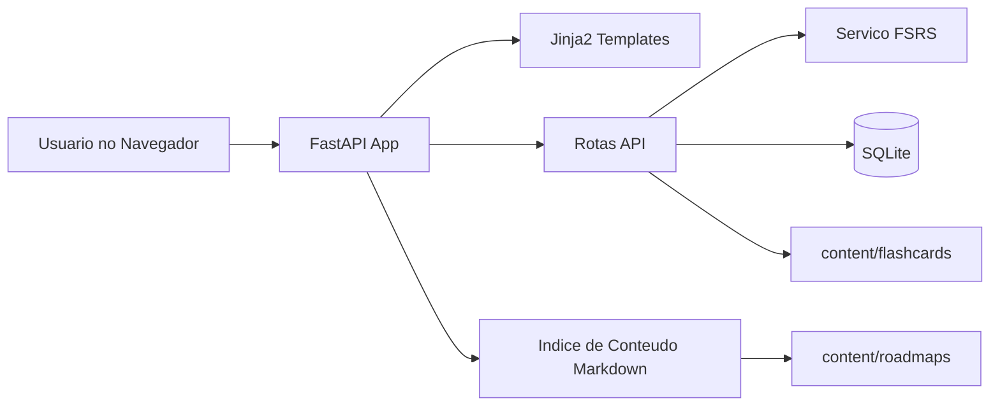
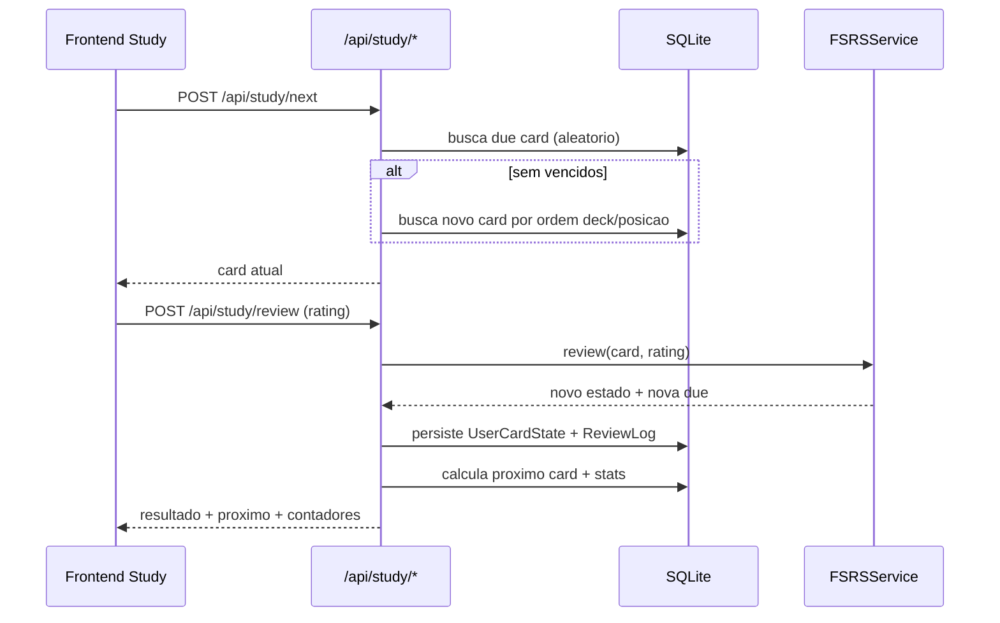

# Roadmap EE&HH - Documentacao Completa da Aplicacao

## Sumario

1. [Visao Geral](#visao-geral)
2. [Proposito da Aplicacao](#proposito-da-aplicacao)
3. [O Problema que Ela Resolve](#o-problema-que-ela-resolve)
4. [Arquitetura em Alto Nivel](#arquitetura-em-alto-nivel)
5. [Estrutura do Repositorio](#estrutura-do-repositorio)
6. [Componentes Principais](#componentes-principais)
7. [Modelo de Dados](#modelo-de-dados)
8. [Fluxos de Negocio](#fluxos-de-negocio)
9. [API HTTP](#api-http)
10. [Seguranca e Anti-Bot](#seguranca-e-anti-bot)
11. [Configuracao por Ambiente](#configuracao-por-ambiente)
12. [Execucao Local](#execucao-local)
13. [Execucao com Docker](#execucao-com-docker)
14. [Scripts de Operacao](#scripts-de-operacao)
15. [Frontend e Experiencia de Uso](#frontend-e-experiencia-de-uso)
16. [Renderizacao de Markdown e Matematica](#renderizacao-de-markdown-e-matematica)
17. [Testes e Qualidade](#testes-e-qualidade)
18. [Observabilidade e Saude do Sistema](#observabilidade-e-saude-do-sistema)
19. [Runbook de Manutencao](#runbook-de-manutencao)
20. [Decisoes Tecnicas e Limites Atuais](#decisoes-tecnicas-e-limites-atuais)
21. [Proximos Passos Recomendados](#proximos-passos-recomendados)
22. [Aplicativo Android e Sync Offline](#aplicativo-android-e-sync-offline)

---

## Visao Geral

O Roadmap EE&HH e uma aplicacao web para executar um ciclo continuo de estudo tecnico com foco em:

- roadmaps em markdown (planejamento enxuto)
- revisao espaçada com FSRS (flashcards)
- progresso pratico orientado por decks e trilhas

A aplicacao centraliza conteudo e revisao em uma interface unica, reduzindo friccao operacional entre:

- leitura da trilha atual
- escolha do deck relevante
- revisao com repeticao espaçada
- acompanhamento de progresso

---

## Proposito da Aplicacao

### Objetivo principal

Transformar um curriculo autodidata (EE + Hardware Hacking) em um fluxo operacional de estudo diario, com consistencia e cadencia.

### Objetivos secundarios

- manter o roadmap simples, objetivo e acionavel
- preservar memoria de longo prazo via FSRS
- reduzir sobrecarga de decidir "o que fazer agora"
- permitir manutencao do conteudo em markdown (facil versionamento)

### Resultado esperado para o usuario

No dia a dia, o usuario deve conseguir:

1. abrir a aplicacao
2. encontrar rapidamente o deck/trilha atual
3. revisar cards vencidos/novos
4. acompanhar o progresso por deck e no total

---

## O Problema que Ela Resolve

Sem a aplicacao, o fluxo de estudo normalmente sofre com:

- fragmentacao entre notas, decks e acompanhamento
- inconsistencias de rotina
- dificuldade de manter revisao espaçada disciplinada
- alto custo cognitivo para navegar entre materiais

Com a aplicacao, o fluxo fica padronizado em um unico ambiente:

- leitura dos roadmaps
- sessao de revisao com classificacao 1..4
- estatisticas e progresso

---

## Arquitetura em Alto Nivel

### Stack

- Backend: FastAPI
- Persistencia: SQLAlchemy + SQLite
- Templates server-side: Jinja2
- Algoritmo de repeticao: FSRS
- Conteudo: Markdown (roadmaps + decks)
- Frontend web: HTML/CSS/JS (sem framework pesado)
- Cliente mobile: Android nativo (Kotlin + WebView + modo offline)

### Diagrama de componentes



### Ciclo de bootstrap no startup

No startup da app:

1. carrega configuracao (`Settings.load`)
2. monta engine e session factory
3. cria tabelas SQL (`Base.metadata.create_all`)
4. indexa markdown dos roadmaps (`content_service.refresh_index`)
5. sincroniza flashcards markdown para banco (`sync_flashcards`)

Esse bootstrap garante que o conteudo no filesystem esteja refletido no runtime.

---

## Estrutura do Repositorio

```text
app/
  main.py                  # bootstrap FastAPI
  config.py                # env/config central
  database.py              # engine/sessao SQLAlchemy
  models.py                # entidades ORM
  content_service.py       # indexacao e render de markdown
  flashcards.py            # parse/sync de decks markdown
  scheduler.py             # adaptador FSRS
  anti_bot.py              # PoW + rate limiter
  security.py              # senha + JWT
  routes/
    auth_routes.py         # login, register, challenge, logout
    study_routes.py        # decks, next, review, stats
    page_routes.py         # paginas HTML
  templates/               # Jinja2 pages
  static/                  # CSS e JS

android-app/
  app/src/main/java/com/roadmap/eehh/MainActivity.kt
  app/src/main/java/com/roadmap/eehh/OfflineStudyActivity.kt
  README.md

content/
  roadmaps/
    decks/*.md             # roadmaps por deck
  flashcards/
    decks/*.md             # decks app-facing

scripts/
  normalize_flashcards_markdown.py
  reindex_flashcards.py

tests/
  test_flashcards.py
  test_study_selection.py
  test_pow.py
  test_sync_routes.py
```

---

## Componentes Principais

### 1) Camada de configuracao

Arquivo: `app/config.py`

Responsavel por:

- carregar variaveis de ambiente
- resolver paths de workspace e flashcards
- definir parametros de seguranca e rate-limit
- definir meta de retencao FSRS

### 2) Camada de conteudo

Arquivo: `app/content_service.py`

Responsavel por:

- descobrir docs markdown permitidos
- classificar documentos por secao/trilha
- gerar slug de URL para documento
- renderizar markdown em HTML com `markdown-it-py`

### 3) Camada de flashcards

Arquivo: `app/flashcards.py`

Responsavel por:

- interpretar decks markdown (`content/flashcards/decks/*.md`)
- extrair cards em formato compacto estrito (`@card ... @@ ...`)
- sincronizar Deck/Card no banco
- manter cards inativos quando removidos da fonte

### 4) Normalizacao de decks markdown

Arquivo: `scripts/normalize_flashcards_markdown.py`

Responsavel por:

- validar parse de todos os decks markdown
- reescrever para formato compacto canonico
- reduzir ruído estrutural sem alterar conteudo funcional
- manter arquivos mais curtos para leitura humana e por LLMs

### 5) Motor de agendamento FSRS

Arquivo: `app/scheduler.py`

Responsavel por:

- mapear estado persistido (`UserCardState`) para `fsrs.Card`
- aplicar review com rating 1..4
- devolver novo estado, proxima data e log

### 6) Seguranca e autenticacao

Arquivos:

- `app/security.py`
- `app/anti_bot.py`
- `app/routes/auth_routes.py`

Responsavel por:

- hash de senha com Argon2
- token JWT em cookie HTTP-only
- desafio de prova de trabalho para auth
- limites de taxa por IP e contexto

### 7) Rotas de estudo

Arquivo: `app/routes/study_routes.py`

Responsavel por:

- listar decks com contadores (novos/vencidos)
- selecionar proximo card
- registrar review e aplicar FSRS
- retornar estatisticas consolidadas

### 8) Rotas de pagina

Arquivo: `app/routes/page_routes.py`

Responsavel por:

- home
- painel de roadmaps
- pagina de documento markdown
- tela de estudo
- tela de estatisticas

---

## Modelo de Dados

Arquivo: `app/models.py`

### Entidades

1. `User`
   - identidade do usuario
   - credenciais e status

2. `Deck`
   - metadados do baralho
   - ordem, titulo, fonte, quantidade de cards

3. `Card`
   - conteudo markdown de pergunta/resposta
   - hash de conteudo
   - posicao dentro do deck

4. `UserCardState`
   - estado FSRS por usuario + card
   - due_at, estabilidade, dificuldade, reps, lapses
   - restricao unica `user_id + card_id`

5. `ReviewLog`
   - historico de revisoes
   - rating, duracao, estado antigo/novo, due antes/depois

6. `SyncEvent`
  - chave de idempotencia para sincronizacao offline
  - restricao unica `user_id + event_id`
  - impede reaplicacao da mesma revisao no servidor

### Relacionamentos principais

- `Deck` 1:N `Card`
- `User` N:N `Card` via `UserCardState`
- `User` 1:N `ReviewLog`
- `User` 1:N `SyncEvent`

---

## Fluxos de Negocio

### Fluxo A: Sessao de estudo



### Fluxo B: Publicacao de deck markdown

1. editar arquivos em `content/flashcards/decks/*.md`
2. rodar normalizacao para manter formato canonico
3. rodar reindex para sincronizar banco

Comandos:

```bash
python3 scripts/normalize_flashcards_markdown.py
python3 scripts/reindex_flashcards.py
```

### Fluxo C: Navegacao de roadmap

1. usuario abre `/roadmap`
2. backend lista docs indexados e categorias de trilha/deck
3. usuario abre `/roadmap/{slug}`
4. markdown e convertido para HTML
5. frontend aplica KaTeX/Mermaid (quando houver)

---

## API HTTP

### Endpoints de autenticacao

- `POST /api/auth/challenge`
  - cria desafio PoW (challenge_id, prefix, difficulty)

- `POST /api/auth/register`
  - payload: username, password, email(opcional), challenge_id, nonce
  - cria usuario e retorna cookie de sessao

- `POST /api/auth/login`
  - payload: login(username/email), password, challenge_id, nonce
  - valida credenciais e retorna cookie de sessao

- `POST /api/auth/logout`
  - limpa cookie de sessao

- `GET /api/me`
  - verifica autenticacao atual

### Endpoints de estudo

- `GET /api/decks`
  - lista decks com contadores (`seen/new/due`)

- `POST /api/study/next`
  - input: `deck_uid` (`all` ou deck especifico)
  - output: card atual ou `empty: true`

- `POST /api/study/review`
  - input: `card_uid`, `rating(1..4)`, `duration_ms`
  - aplica FSRS e retorna:
    - estado atualizado
    - proximo card
    - decks atualizados
    - quick stats

- `GET /api/stats/summary`
  - overview global + progresso por deck

### Endpoints de sync offline

- `GET /api/sync/export`
  - query: `deck_uid` (default: `all`)
  - retorna snapshot de cards ativos com estado por usuario:
    - conteudo (`question_md`, `answer_md`, `content_hash`)
    - metadados (`deck_uid`, `deck_title`, `position`)
    - estado (`is_new`, `due_at`, `fsrs_state`, `fsrs_step`, `reps`, `lapses`)
  - inclui `decks` e `quick_stats` para atualizar UI

- `POST /api/sync/import`
  - payload: lista de eventos `{event_id, card_uid, rating, duration_ms, reviewed_at}`
  - validacoes:
    - maximo de 1000 eventos por request
    - normalizacao e parse de `reviewed_at`
    - remocao de duplicados no proprio payload
  - processamento:
    - ordena por `reviewed_at` ascendente
    - aplica FSRS para cada evento valido
    - grava `ReviewLog`, atualiza `UserCardState`, registra `SyncEvent`
  - resposta:
    - `accepted`, `duplicates`, `errors`
    - `decks` e `quick_stats` atualizados

### Endpoints de pagina

- `GET /`
- `GET /auth/login`
- `GET /auth/register`
- `GET /roadmap`
- `GET /roadmap/{slug}`
- `GET /study`
- `GET /stats`
- `GET /healthz`

---

## Seguranca e Anti-Bot

### Controles existentes

1. **Senha com Argon2**
   - hash forte para credenciais

2. **Sessao via JWT em cookie HTTP-only**
   - evita acesso direto por JS ao token

3. **Proof-of-Work no login/cadastro**
   - challenge + nonce exigidos para auth

4. **Rate limiting**
   - limites para challenge, login, register e review

5. **Honeypot em formularios**
   - campo oculto para detectar bots simples

6. **Headers de hardening**
   - `X-Frame-Options: DENY`
   - `X-Content-Type-Options: nosniff`
   - `Referrer-Policy: strict-origin-when-cross-origin`

### Observacoes de operacao

- em ambiente sem HTTPS, `COOKIE_SECURE` deve permanecer `false`
- ao ativar HTTPS real, ajustar `COOKIE_SECURE=true`

---

## Configuracao por Ambiente

Arquivo de referencia: `.env.example`

### Variaveis principais

| Variavel | Finalidade | Exemplo |
|---|---|---|
| `APP_NAME` | nome da app | `Roadmap EE&HH` |
| `APP_SECRET_KEY` | chave JWT | string longa aleatoria |
| `SESSION_COOKIE_NAME` | nome do cookie | `roadmap_session` |
| `SESSION_HOURS` | duracao da sessao | `336` |
| `COOKIE_SECURE` | exige HTTPS para cookie | `false` |
| `DATABASE_URL` | conexao banco | `sqlite:////srv/roadmap/data/study_os.db` |
| `ROADMAP_WORKSPACE_ROOT` | raiz do workspace | `/srv/roadmap/workspace` |
| `CONTENT_ROOT` | raiz do conteudo (flashcards + roadmaps) | `/srv/roadmap/workspace/content` |
| `POW_DIFFICULTY` | dificuldade PoW | `3` |
| `POW_TTL_SECONDS` | validade desafio PoW | `180` |
| `AUTH_RATE_LIMIT_PER_MINUTE` | limite auth por minuto | `20` |
| `CHALLENGE_RATE_LIMIT_PER_MINUTE` | limite de desafio por minuto | `80` |
| `REVIEW_RATE_LIMIT_PER_MINUTE` | limite de reviews por minuto | `240` |
| `FSRS_DESIRED_RETENTION` | meta de retencao | `0.9` |
| `WEB_PORT` | porta web externa | `8088` |

---

## Execucao Local

### 1) Preparar ambiente

```bash
python3 -m venv .venv
source .venv/bin/activate
pip install -r requirements.txt
```

### 2) Subir aplicacao

```bash
uvicorn app.main:app --reload --host 0.0.0.0 --port 8088
```

### 3) Acessar

- Home: `http://localhost:8088/`
- Health: `http://localhost:8088/healthz`

---

## Execucao com Docker

### Build e subida

```bash
docker compose up --build -d
```

### Caracteristicas do compose

- porta exposta: `${WEB_PORT:-8088}:8088`
- volume de dados: `./data:/srv/roadmap/data`
- volume workspace readonly: `./:/srv/roadmap/workspace:ro`
- healthcheck em `/healthz`

### Imagem

- base: `python:3.12-slim`
- comando: `uvicorn app.main:app ...`

---

## Scripts de Operacao

### 1) Normalizar decks markdown

Arquivo: `scripts/normalize_flashcards_markdown.py`

Uso padrao:

```bash
python3 scripts/normalize_flashcards_markdown.py
```

### 2) Reindexar flashcards no banco

Arquivo: `scripts/reindex_flashcards.py`

Uso:

```bash
python3 scripts/reindex_flashcards.py
```

Saida esperada (exemplo):

```json
{
  "decks": 31,
  "cards": 2049,
  "updated": 2080,
  "inactive": 0
}
```

### 3) Deploy automatizado para Debian

Arquivo: `scripts/deploy_debian.sh`

Uso recomendado:

```bash
DEPLOY_HOST=user@server DEPLOY_DIR=/srv/roadmap_web scripts/deploy_debian.sh
```

Exemplo com health publico explicito:

```bash
DEPLOY_HOST=user@server DEPLOY_DIR=/srv/roadmap_web HEALTH_PUBLIC=https://example.com/healthz scripts/deploy_debian.sh
```

O script faz:

- sincronizacao de codigo (preservando `data/` e `.env` remotos)
- exclusao de artefatos pesados do Android no sync (`android-app/.gradle`, `android-app/build`, `android-app/app/build`)
- `docker compose up --build -d` no servidor
- validacao de `healthz` local e publico

---

## Frontend e Experiencia de Uso

### Paginas principais

1. **Home (`/`)**
  - resumo de decks ativos
  - atalhos para estudar e roadmaps

2. **Roadmaps (`/roadmap`)**
  - grid de documentos de roadmap
  - filtro de busca por trilha/deck

3. **Documento (`/roadmap/{slug}`)**
  - render completo do markdown
  - decks relacionados a mesma trilha

4. **Estudo (`/study`)**
  - deck drawer
  - flashcard com flip pergunta/resposta
  - avaliacao por botoes/teclado (1..4)

5. **Progresso (`/stats`)**
  - indicadores globais
  - tabela por deck

### JS de pagina

- `app/static/js/auth.js`
  - resolve PoW no browser
  - envia payload de login/register

- `app/static/js/study.js`
  - controla sessao de estudo
  - renderiza cards e transicoes
  - envia review e aplica resposta combinada da API

- `app/static/js/stats.js`
  - consome `/api/stats/summary`

- `app/static/js/site.js`
  - nav, logout, enhancement markdown

---

## Aplicativo Android e Sync Offline

### Escopo atual do app Android

Cliente em `android-app/` com:

- `MainActivity`: WebView da aplicacao web
- `OfflineStudyActivity`: estudo offline e sincronizacao
- persistencia de sessao por cookie (SharedPreferences)

### Persistencia de sessao no Android

Problema resolvido: sessao era perdida entre aberturas do app.

Comportamento implementado:

1. cookies sao lidos do `CookieManager`
2. header de cookie e salvo em `SharedPreferences`
3. no startup, cookies sao restaurados antes de abrir a URL

Resultado: o app mantem login entre relancamentos (respeitando expiracao do cookie servidor).

### Armazenamento offline local

Arquivos locais em `filesDir`:

- `offline_cards_v1.json`: snapshot dos cards e estado
- `offline_pending_reviews_v1.json`: fila de eventos pendentes

### Fluxo offline -> online

1. usuario loga online no app
2. app chama `GET /api/sync/export?deck_uid=all` para baixar snapshot
3. usuario revisa offline; cada review gera evento com:
  - `event_id` (UUID)
  - `card_uid`
  - `rating`
  - `duration_ms`
  - `reviewed_at`
4. app envia fila em `POST /api/sync/import`
5. servidor processa com idempotencia por `SyncEvent`
6. app remove eventos sincronizados e faz novo `sync/export` para atualizar estado local

### Garantias do sync

- retries seguros: mesmo evento pode ser reenviado sem duplicar review
- idempotencia forte por usuario+evento no banco
- consistencia eventual: apos import+export, estado local converge com servidor

### Observacoes de implementacao

- a ordenacao de eventos no import e por `reviewed_at` para manter causalidade da fila offline
- eventos invalidos (ex.: card removido) retornam em `errors` sem travar o lote inteiro
- agendamento local offline e simplificado; estado final autoritativo vem do servidor apos sync

---

## Renderizacao de Markdown e Matematica

### No backend (roadmap docs)

- parser: `markdown-it-py`
- plugins: tasklists e footnotes
- HTML inline no markdown desabilitado (`html=False`)

### No frontend (conteudo dinamico)

- `marked` para markdown dinamico
- `DOMPurify` para sanitizacao
- `KaTeX` para matematica
- `Mermaid` para diagramas

---

## Testes e Qualidade

Suite atual em `tests/` cobre:

- parsing/sync de flashcards
- selecao de proximo card
- roundtrip de proof-of-work
- import/export de sync offline com idempotencia (`tests/test_sync_routes.py`)

Executar:

```bash
python -m pytest
```

---

## Observabilidade e Saude do Sistema

### Endpoint de saude

- `GET /healthz`
- resposta: `{ "status": "ok" }`

### Indicadores praticos para operacao

- quantidade de decks/cards em `/api/stats/summary`
- saida dos scripts de import/reindex
- healthcheck do container

---

## Runbook de Manutencao

### Atualizar conteudo de roadmap

1. editar `content/roadmaps/decks/*.md`
2. reiniciar app ou acionar refresh no startup

### Atualizar conteudo de flashcards

1. editar `content/flashcards/decks/*.md`
2. rodar `scripts/normalize_flashcards_markdown.py`
3. rodar reindex
4. executar testes

### Verificar consistencia de paths

- `content/flashcards/decks/*.md` e a fonte unica de cards
- deck deve seguir formato compacto `@card` / `@@`

### Backup minimo recomendado

- `data/study_os.db`
- `content/` (roadmaps + decks markdown)

---

## Decisoes Tecnicas e Limites Atuais

### Decisoes

- markdown como formato canonico de conteudo exibivel
- SQLAlchemy + SQLite para simplicidade operacional
- server-side templates para manter stack leve
- FSRS para agendamento de revisao

### Limites atuais

- sem mecanismo de undo no review (ha placeholder no frontend)
- sem painel admin dedicado para edicao de conteudo
- sem observabilidade externa (metrics/tracing centralizados)
- sem multi-tenant; foco em uso pessoal/pequeno grupo

---

## Proximos Passos Recomendados

1. Implementar undo real de review na API e no frontend
2. Adicionar migracoes formais de banco (ex.: Alembic)
3. Expor endpoint de refresh de indice com autenticacao
4. Criar pagina de operacao com status de import/reindex
5. Incluir testes E2E dos fluxos de autenticacao e estudo

---

## Atualizacoes Recentes (2026-04-06)

### 1) App Android com sessao persistente e modo offline

Escopo implementado:

- persistencia de cookie de sessao no Android (`MainActivity`)
- nova tela `OfflineStudyActivity` para estudo offline
- download de snapshot (`/api/sync/export`)
- fila local de revisoes pendentes
- sincronizacao posterior (`/api/sync/import`)

### 2) Backend de sync offline

Escopo implementado:

- tabela `sync_events` para idempotencia
- endpoint `GET /api/sync/export`
- endpoint `POST /api/sync/import`
- deduplicacao no payload + deduplicacao persistente por `event_id`
- processamento ordenado por horario de review

### 3) Qualidade e testes

- novos testes em `tests/test_sync_routes.py`
- suite local executada com sucesso (8 testes)

### 4) Deploy e validacao operacional

Deploy executado com sucesso usando `scripts/deploy_debian.sh`, incluindo:

- rebuild da imagem e restart do servico
- health check local (`127.0.0.1:8088/healthz`) OK
- health check publico (`https://seu-host-publico/healthz`) OK
- smoke test de rotas principais OK (`/`, `/roadmap`, `/study`, `/stats`)
- container em estado `healthy`

### 5) Hardening operacional mantido

- app em bind local no host (`127.0.0.1:8088`), exposto externamente via Tailscale Funnel
- permissoes de `.env` restritas no servidor
- fail2ban ativo
- n8n e app permanecem publicados via HTTPS conforme requisito

---

## Atualizacoes Recentes (2026-04-05)

### 1) Roadmaps de deck atualizados em lote

Foi feita revisao completa dos roadmaps de deck em `content/roadmaps/decks/*.md`.

Escopo aplicado:

- leitura do conteudo dos 31 decks em `content/flashcards/decks/*.md`
- reescrita detalhada da secao **"Topicos estudados"** em todos os decks
- substituicao da secao **"Projetos conectados ao deck"**
- remocao dos projetos antigos e inclusao de propostas novas com criterio:
  - engajantes/divertidas
  - apresentaveis como portfolio
  - cobrindo os assuntos principais do deck
  - anti-IA (exigem medicao, evidencias proprias, justificativa tecnica e iteracao)

Resultado:

- 31/31 arquivos de roadmap de deck atualizados
- estrutura padronizada preservada (`Topicos` / `Sequencia` / `Projetos` / `Criterio` / `Navegacao`)

### 2) Correcao de renderizacao matematica no frontend

Sintoma observado:

- cards mostravam LaTeX cru (ex.: `$\\lim_{x \\to a} ...$`) na tela de estudo

Causa raiz:

- hashes SRI (`integrity`) do KaTeX em `app/templates/base.html` estavam incorretos
- o navegador bloqueava os assets do CDN por falha de integridade

Correcao aplicada:

- atualizacao dos tres hashes SRI para os valores corretos da versao `katex@0.16.11`:
  - `katex.min.css`
  - `katex.min.js`
  - `contrib/auto-render.min.js`

Impacto:

- `renderMathInElement` volta a executar normalmente
- formulas em perguntas/respostas voltam a ser renderizadas no estudo

### 3) Deploy operacional no servidor Debian

Ambiente de deploy:

- host: `user@server`
- raiz: `/srv/roadmap_web`
- servico: `docker compose` (`roadmap-web`)

Procedimento recomendado:

1. sincronizar codigo local para a pasta de deploy (via `rsync` ou `tar` por SSH)
2. no servidor, entrar em `/srv/roadmap_web`
3. executar `docker compose up --build -d`
4. validar saude:
   - local do host: `http://127.0.0.1:8088/healthz`
   - endpoint externo (quando aplicavel): `.../healthz`

---

## Resumo Executivo

O Roadmap EE&HH e um sistema web focado em disciplina de estudo tecnico, unindo:

- **direcao** (roadmaps em markdown)
- **memoria** (FSRS com tracking por usuario)
- **execucao** (fluxo de revisao rapido e objetivo)

Com isso, a aplicacao transforma um repositorio de conteudo em um ambiente operacional de estudo continuo, com manutencao simples e evolucao incremental.
