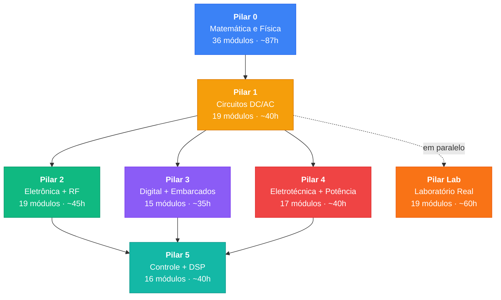

# Roadmaps de Engenharia Elétrica — Índice

> **Origem**: Baseado no [Syllabus Mestre](Syllabus%20Mestre.md), expandido de 93 linhas para ~92 módulos detalhados.
>
> **Metodologia**: "Engenharia Reversa do Conhecimento" — **Simular → Falhar → Questionar (IA) → Modelar**. Cada módulo é uma sessão de 1-3h com teoria focada, intuição, e projeto prático em simulador.

---

## Mapa dos 7 Pilares

> **Total: ~340h** (~6-9 meses com 2h/dia)

---

## Os 7 Roadmaps

### Pilar 0 — Matemática e Física (A Base Intuitiva)
📄 **Arquivo**: [ee_matematica_fisica_roadmap.md](ee_matematica_fisica_roadmap.md)
**Ferramentas**: Python (numpy/matplotlib/sympy), Desmos, 3Blue1Brown
⏱️ **Tempo**: ~87h | **Módulos**: ~36
📋 **Tópicos**: Unidades SI, álgebra, funções, trigonometria e senóides, números complexos e fasores, decibéis, limites, derivadas (regra cadeia/produto), séries de Taylor, integrais (técnicas: substituição/partes/frações parciais), aplicações (RMS, energia), cálculo multivariável (gradiente, divergência, rotacional), equações de Maxwell (forma diferencial), EDOs 1ª e 2ª ordem (RC/RL/RLC), transformada de Laplace, álgebra linear (vetores, matrizes, autovalores/estabilidade), probabilidade e estatística (Gaussiana, SNR, tolerâncias, Monte Carlo), mecânica (Newton, rotação/torque, oscilações/ondas), termodinâmica (circuitos térmicos, dissipadores), eletrostática (Coulomb, Gauss, capacitância), magnetostática (Ampère, Biot-Savart, indutores), indução (Faraday, geradores, transformadores), ondas EM (Maxwell, espectro, antenas), física moderna (bandas de energia, semicondutores, junção PN)

> **Pré-requisito**: Nenhum. Comece aqui se precisa reforçar matemática/física, ou avance direto para o Pilar 1 se já tem base sólida.

---

### Pilar 1 — Fundamentos de Circuitos (O Universo DC/AC)
📄 **Arquivo**: [ee_circuitos_roadmap.md](ee_circuitos_roadmap.md)
**Ferramentas**: Falstad (intuição visual), LTspice (análise precisa)
⏱️ **Tempo**: ~40h | **Módulos**: ~18
📋 **Tópicos**: Lei de Ohm, Kirchhoff, divisores, Thévenin/Norton, capacitores, indutores, transitórios RC/RL/RLC, corrente alternada, fasores, impedância, potência AC, filtros passivos, ressonância, transformadores ideais

> **Pré-requisito**: Pilar 0 (ou base sólida em matemática/física). Este é o ponto de partida técnico.

---

### Pilar 2 — Eletrônica Analógica e de Potência
📄 **Arquivo**: [ee_eletronica_roadmap.md](ee_eletronica_roadmap.md)
**Ferramentas**: LTspice (circuitos precisos), Falstad (intuição de semicondutores)
⏱️ **Tempo**: ~45h | **Módulos**: ~19
📋 **Tópicos**: Diodos, BJT, MOSFET, amp-ops, reguladores lineares, conversores DC-DC, fontes chaveadas, **linhas de transmissão, carta de Smith, parâmetros S, EMC**

> **Pré-requisito**: Pilar 1 completo (leis de circuito + AC obrigatórios).

---

### Pilar 3 — Sistemas Digitais e Microcontrolados
📄 **Arquivo**: [ee_digital_embarcados_roadmap.md](ee_digital_embarcados_roadmap.md)
**Ferramentas**: Falstad (portas lógicas), Proteus/Tinkercad (microcontroladores), Wokwi (Arduino online)
⏱️ **Tempo**: ~35h | **Módulos**: ~15
📋 **Tópicos**: Sistemas numéricos, portas lógicas, álgebra booleana, Karnaugh, circuitos combinacionais (MUX, decoders, somadores), circuitos sequenciais (flip-flops, contadores, registradores), FSM, arquitetura de CPU, Arduino (GPIO, ADC, PWM, timers, interrupções), comunicação serial (UART, SPI, I2C), projetos integrados

> **Pré-requisito**: Pilar 1 (conceitos de tensão/corrente/digital). Pilar 2 módulo de transistores recomendado.

---

### Pilar 4 — Eletrotécnica e Automação Industrial
📄 **Arquivo**: [ee_eletrotecnica_automacao_roadmap.md](ee_eletrotecnica_automacao_roadmap.md)
**Ferramentas**: CADe SIMU (comandos elétricos), PC_SIMU (PLCs), LTspice (transformadores/motores)
⏱️ **Tempo**: ~40h | **Módulos**: ~17
📋 **Tópicos**: Sistemas trifásicos, transformadores, motores de indução, partida de motores, inversores, proteção elétrica, instalações (NBR 5410), CLPs, Ladder, sensores industriais, **gerador síncrono, sistemas de potência (pu, curto-circuito), harmônicos**

> **Pré-requisito**: Pilar 1 completo (AC essencial). Pilar 2 recomendado para eletrônica de potência.

---

### Pilar 5 — Controle e Sinais (A Engenharia Matemática)
📄 **Arquivo**: [ee_controle_sinais_roadmap.md](ee_controle_sinais_roadmap.md)
**Ferramentas**: MATLAB/Simulink (modelagem), Octave (alternativa gratuita), Python (scipy/control)
⏱️ **Tempo**: ~40h | **Módulos**: ~16
📋 **Tópicos**: Sinais, convolução, Fourier/FFT, Laplace, funções de transferência, Bode, Nyquist, PID, lugar das raízes, controle digital, **amostragem/Nyquist/aliasing, transformada Z, filtros FIR/IIR, DSP prático (janelamento, espectrograma, PSD)**

> **Pré-requisito**: Pilar 1 completo. Pilares 2 e 4 recomendados.

---

### Pilar Lab — Laboratório Real (Do Simulador à Bancada)
📄 **Arquivo**: [ee_laboratorio_real_roadmap.md](ee_laboratorio_real_roadmap.md)
**Ferramentas**: Multímetro, osciloscópio, ferro de solda, KiCad, protoboard, Arduino/ESP32 físico
⏱️ **Tempo**: ~60h | **Módulos**: ~19
📋 **Tópicos**: Equipamentos de bancada, multímetro, protoboard, transitórios reais, osciloscópio, fontes reais, soldagem, perfboard, PCB design (KiCad: esquemático/layout/Gerber/fabricação), Arduino/ESP32 físico, sensores/atuadores reais, IoT real, debugging de hardware, EMI/aterramento, projeto completo do conceito à PCB fabricada

> **Pré-requisito**: Estudar EM PARALELO com Pilares 1-5. Cada módulo indica de qual pilar é pré-requisito.

---

## Setup Inicial (Uma Vez)

Antes de iniciar qualquer pilar, instale as ferramentas necessárias:

| Ferramenta | Tipo | Instalação | Usado em |
|-----------|------|-----------|----------|
| [Falstad](https://www.falstad.com/circuit/) | Web (sem instalar) | Abrir no browser | Pilares 1, 2, 3 |
| [LTspice](https://www.analog.com/ltspice) | Desktop (gratuito) | Download + instalar (Windows/Linux via Wine) | Pilares 1, 2, 4 |
| [Wokwi](https://wokwi.com/) | Web (sem instalar) | Abrir no browser | Pilar 3 |
| [Proteus](https://www.labcenter.com/) | Desktop (pago/trial) | Download | Pilar 3 |
| [CADe SIMU](https://www.cadesimu.net/) | Desktop (gratuito) | Download | Pilar 4 |
| [GNU Octave](https://octave.org/) | Desktop (gratuito) | `sudo apt install octave` | Pilar 5 |
| [Desmos](https://www.desmos.com/calculator) | Web (sem instalar) | Abrir no browser | Pilar 0 |
| [Python + scipy](https://scipy.org/) | Desktop (gratuito) | `pip install numpy scipy matplotlib sympy control` | Pilares 0, 5 |

---

## Ordem de Estudo Recomendada

**Se tem tempo para fazer tudo sequencialmente:**
1. Pilar 0 (3-4 semanas) → 2. Pilar 1 (4-6 semanas) → 3. Pilar 2 (4-5 semanas) → 4. Pilar 3 (3-5 semanas) → 5. Pilar 4 (3-4 semanas) → 6. Pilar 5 (3-4 semanas)

**Se quer otimizar tempo (estudo paralelo):**
- Semanas 1-4: Pilar 0 (ou pule se já tem base)
- Semanas 3-8: Pilar 1 (pode começar em paralelo com final do Pilar 0)
- Semanas 6-12: Pilar 3 (começa quando entender tensão/corrente)
- Semanas 9-14: Pilar 2 (precisa de AC completo)
- Semanas 12-16: Pilar 4 (precisa de AC e semicondutores básicos)
- Semanas 14-18: Pilar 5 (precisa de tudo anterior)

---

> **Nota**: Cada roadmap segue a metodologia do Syllabus Mestre: **Simular → Falhar/Observar → Questionar (IA Socrática) → Modelar**. Os projetos são 100% simuláveis — você não precisa de nenhum componente físico para completar este currículo.
